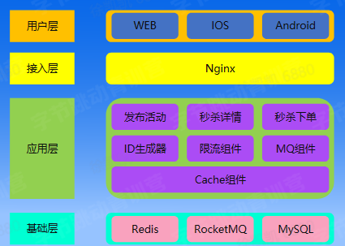
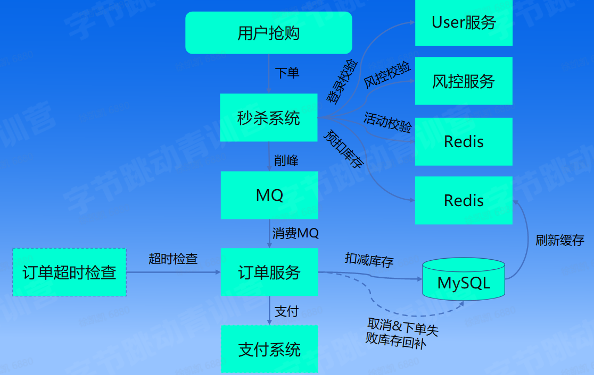

## 系统设计方法论

*   系统设计的概念是什么
*   如何做系统设计
    *   4S分析法（场景、存储、服务、扩展）
*   如何分析系统瓶颈和优化
    *   火焰图分析
    *   链路分析
    *   全链路压测
*   如何验证系统的可用性和稳定性
    *   链路梳理
    *   可观测性
    *   全链路测试
    *   稳定性控制
    *   容灾演练

## 电商秒杀业务介绍

### 基本概念

*   Spu(Standard Product Unit)

商品信息聚合的最小单位，是一组可复用、易检索的标准化信息的集合，该集合描述了一个产品的特性。

*   Sku(Stock Keeping Unit)

物理上不可分割的最小存货单元。

### 秒杀的特点

*   瞬时流量高
*   读多写少
*   实时性要求高

### 秒杀的挑战

*   资源有限性
*   反欺诈
*   高性能
*   防止超卖
*   流量管控
*   扩展性
*   鲁棒性

### 设计流程

#### 4S分析

*   场景分析

秒杀场景读多写少，可使用Redis作为缓存层，并且进行缓存预热

并发量大，不能直接调用扣减库存、生成订单等API，可以加入MQ进行流量削峰

*   存储设计

Localcache、Redis、MySQL

将系统细分为如下模块：秒杀服务、商品服务、订单服务和支付服务

*   服务设计

基础组件：ID生成器、缓存组件、MQ组件、限流组件

库存扣减应该加锁实现

借用Redis来实现分布式事务（seata，ZK都可以实现）

*   可扩展性

流量隔离、流量管控、CDN、缓存优化、数据库扩展、Redis扩展、服务水平垂直扩展

#### 系统架构图

## 课程实践

### 秒杀流程

## 课后总结

今天课程是实践课，课上学习了如何实现一个秒杀系统。之前的课程中一直学习的是Go语言，但这次实践课使用的却是java，不过从系统设计的角度出发，语言并不是最关键的因素。

**高性能系统的通用设计思想**非常重要，秒杀系统的扩展方面还有很大的空间
