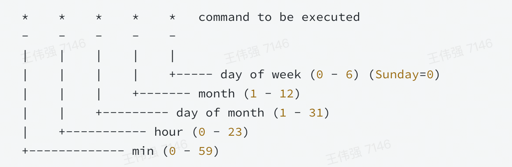
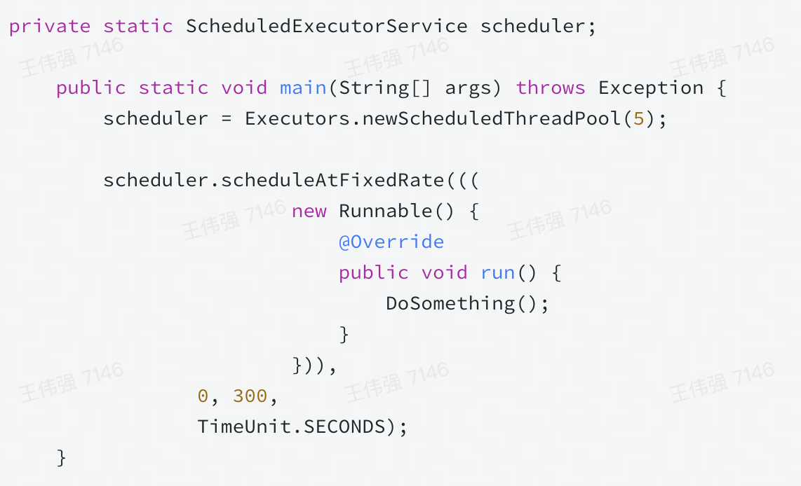
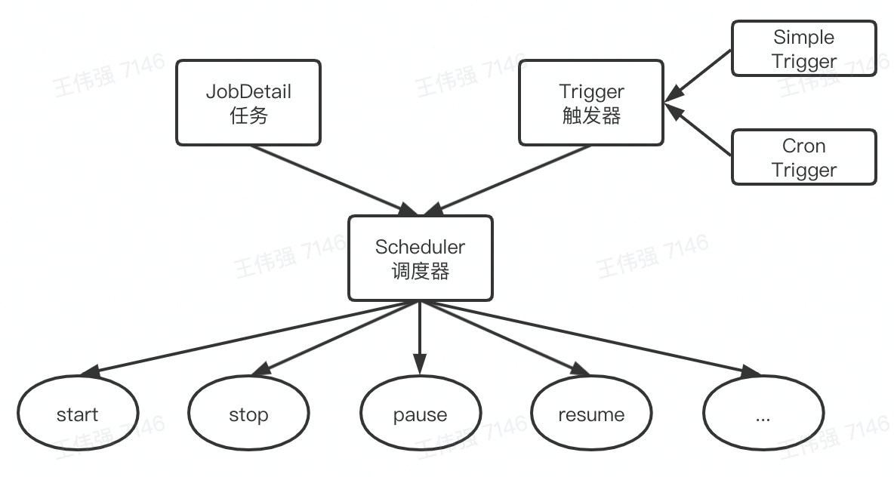
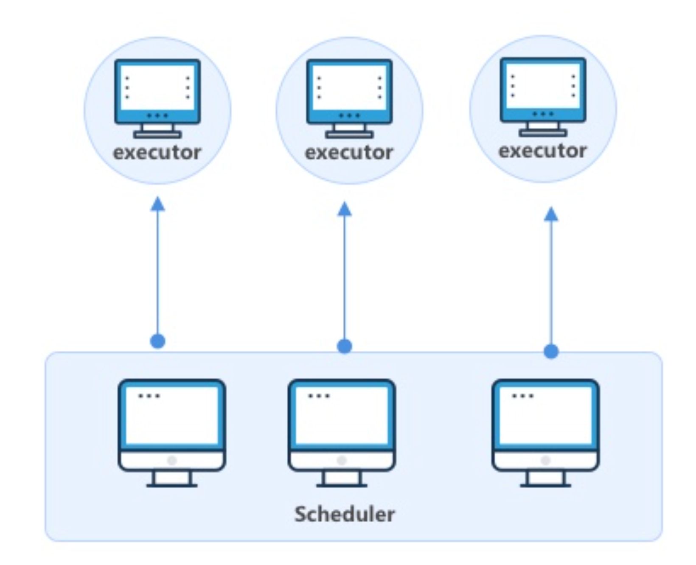
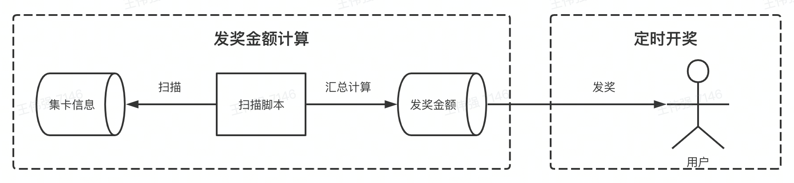
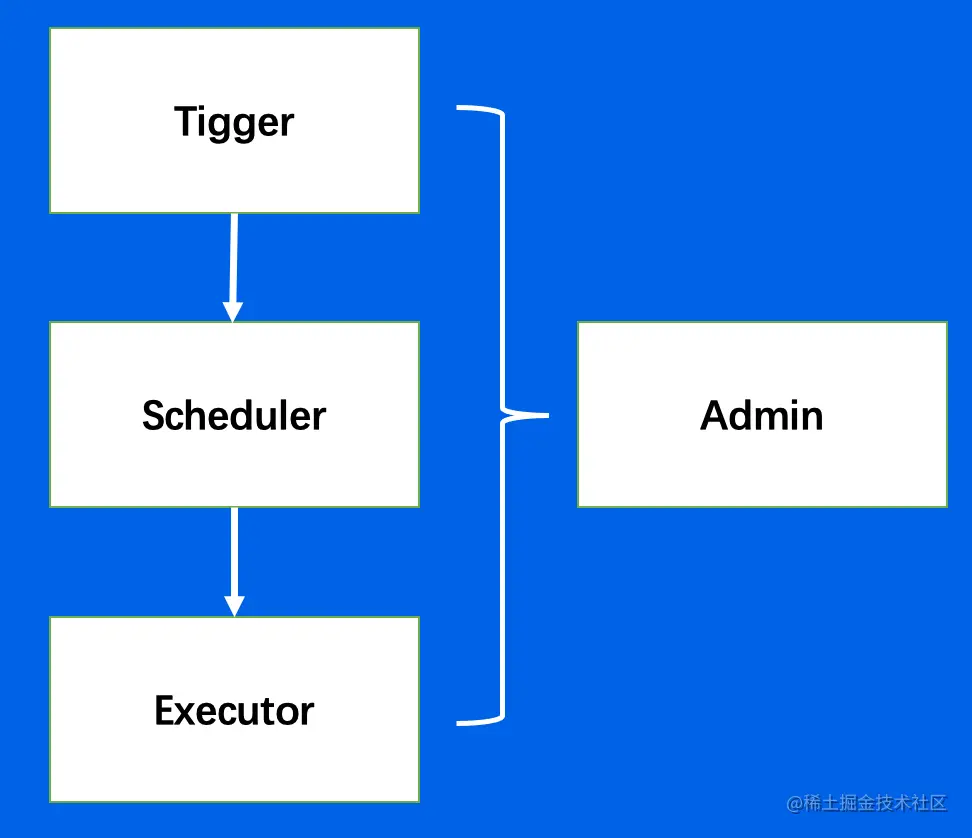
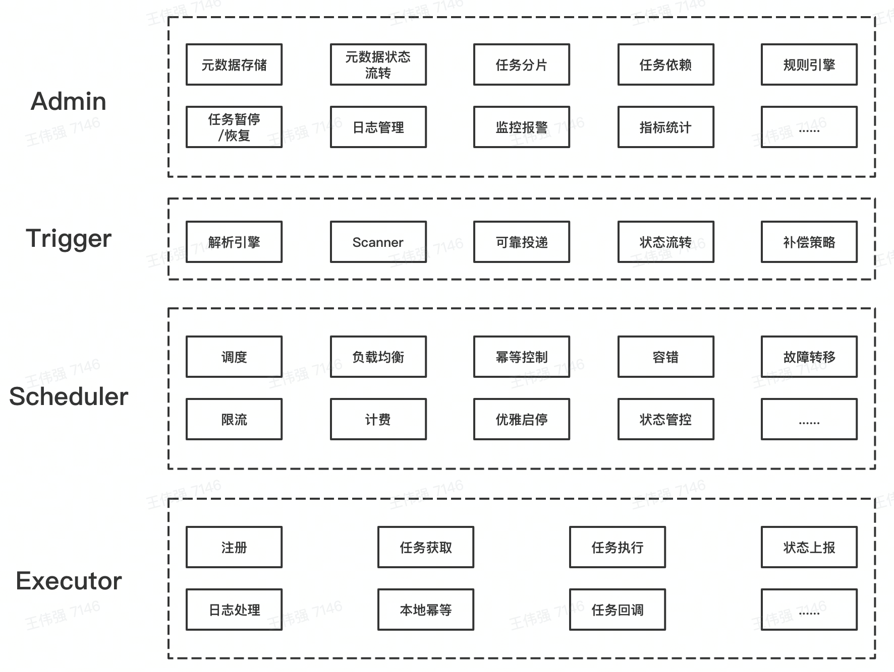
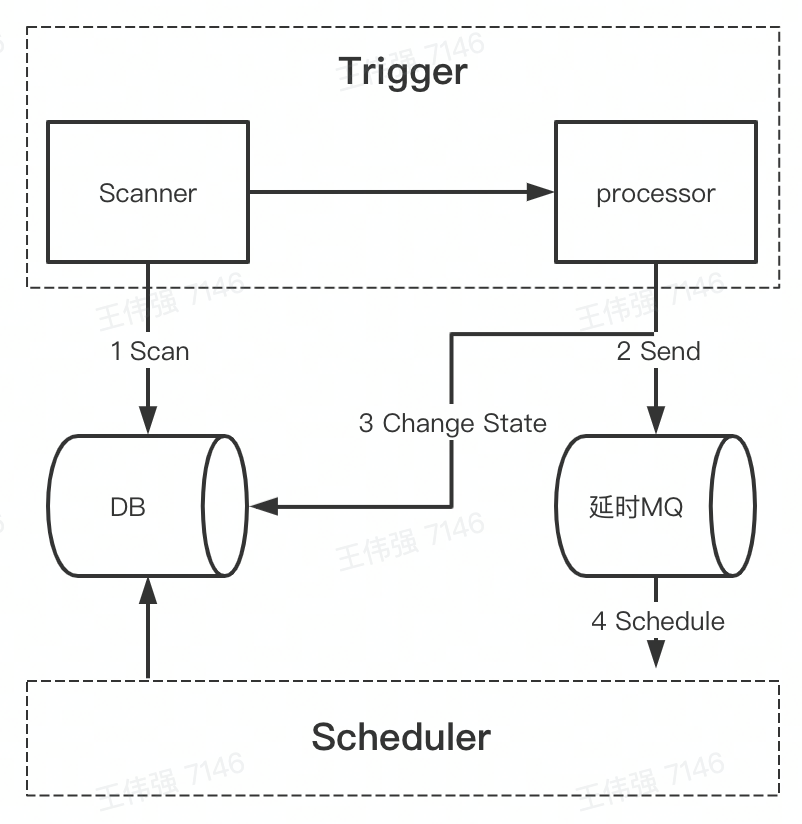
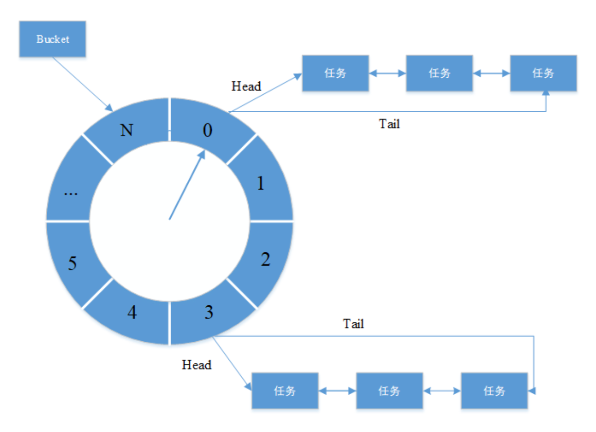
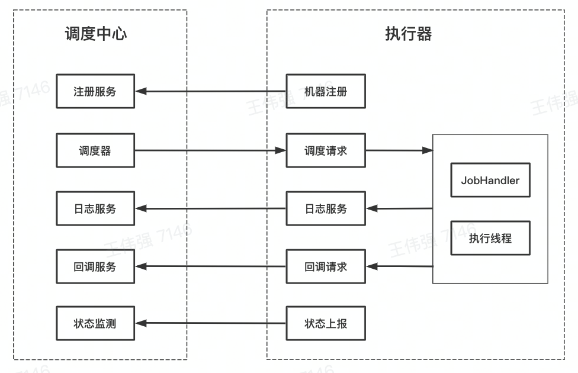

## 一、前言

*   业务流程
    
    *   定时扫描抖音用户集卡状态
    *   汇总计算用户的瓜分金额
    *   定时开奖
*   技术体量
    
    *   亿级用户规模
    *   十亿级资金规模
    *   百万级读写QPS
*   方案引出
    
    *   自动化 + 定时执行 + 海量数据 + 高效稳定 = 分布式定时任务

## 二、发展历程

### 发展历史

*   Windows批处理
    
*   Windows任务计划程序
    
*   Linux命令-CronJob
    

*   单机定时任务-Timer、Ticker
    
*   单机定时任务-ScheduledExecutorService
    

*   任务调度- Quartz

*   分布式定时任务

### 分布式定时任务

#### 定义

*   定时任务是指系统为了**自动**完成特定任务，**实时、延时、周期**性完成任务调度的过程。
*   分布式定时任务是把分散的、可靠性差的定时任务纳入统一的**平台**，并实现集群管理调度和**分布式部署**的一种定时任务的管理方式。

#### 特点

*   自动化、平台化、分布式、伸缩性、高可用
    
*   执行方式
    
    *   单机任务
    *   广播任务
    *   Map任务
    *   MapReduce任务

**发奖金额计算：MapReduce 定时开奖：Map**

#### 业内定时任务框架

*   大众点评Xxl-job
    
    Xxl-job很大一个优势在于开源且免费，并且轻量级，开箱即用，操作简易，上手快，企业维护起来成本不高，因而在中小型公司使用非常广泛。
    
*   阿里巴巴SchedulerX
    
    分布式任务调度SchedulerX2.0是阿里巴巴基于Akka架构自研的新一代分布式任务调度平台，提供定时调度、调度任务编排和分布式批量处理等功能。 SchedulerX可在阿里云付费使用。它功能非常强大，在阿里巴巴内部广泛使用并久经考验。
    
*   腾讯TCT
    
    仅在内部使用，未开源、未商用
    

## 三、实现原理

### 整体架构

*   核心架构

*   数据流

.png)

*   功能架构

### 控制台Admin

*   任务：Job，任务元数据
*   任务实例：JobInstance,周期任务会生 成多个任务实例
*   任务结果：JobResult,任务实例运行的 结果
*   任务历史：JobHistory,用户可以修改任 务信息，任务实例对应的任务元数据可 以不同，因而使用任务历史存储

### 触发器Trigger

*   定期扫描+ 延时消息（腾讯、字节方案）

*   时间轮（Quartz方案）
    
    时间轮是一种高效利用线程资源进行批量化调度的一种调度模型。时间轮是一个存储环形队列，底层采用数组实现，数组中的每个元素可以存放一个定时任务列表。
    

*   高可用
    *   存储：不同国别、业务做资源隔离
    *   运行：不同级别、业务分开执行
    *   部署：采用多机房集群化部署，避免单点故障，通过数据库锁或分布式锁保证只被触发一次

调度器Scheduler

#### 资源来源

*   业务系统
    *   优点：任务执行逻辑与业务系统共用一份资源，利用率更高
    *   缺点：容易发生影响在线服务的事故，不能扩缩容
*   定时任务平台
    *   优点：任务执行逻辑与业务系统相互隔离，优雅地扩缩容
    *   缺点：消耗更多机器资源，需要额外为定时任务平台申请接口调用权限

#### 资源调度

*   节点选择
    *   随机节点执行：选择集群中一个可用的执行节点执行调度任务。适用场景：定时对账。
    *   广播执行：在集群中所有的执行节点分发调度任务并执行。适用场景：批运维。
    *   分片执行：按照用户自定义分片逻辑进行拆分，分发到集群中不同节点并行执行，提升资源利用效率。适用场景：海星日志统计。
*   任务分片
    *   通过任务分片来提高任务执行的效率和资源地利用率
*   故障转移
    *   分片任务基于一致性hash策略分发任务，当某Executor异常时，调度器会将任务分发到其他Executor，任务最终成功

#### 执行器Executor

## 四、业务应用

所有需要定时、延时、周期性执行任务的业务场景，都可以考虑使用分布式定时任务

*   电商
    *   订单30分钟未付款自动关闭订单
    *   定时给商家、达人发送消品，给·的奖励用户发放优惠券等
*   互动
    *   支付宝集五福
    *   字节吞节集卡瓜分红包
*   游戏
    *   活动估束后批量补发用户未领取
    *   定期更新游戏内榜单

## 五、课程收获

*   知识面扩充
    *   对分布式定时任务建立起宏观的认知，并深入了解其实现原理
    *   了解关联的单机定时任务、大数据处理引擎，通过了解不同实现方案的优劣来拓展知识面
*   项目实践能力加强
    *   了解在哪些实际业务场景中使用分布式定时任务
    *   对于实际业务场景的中间件选型、技术方案设计做到成竹在胸
