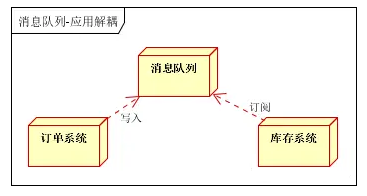
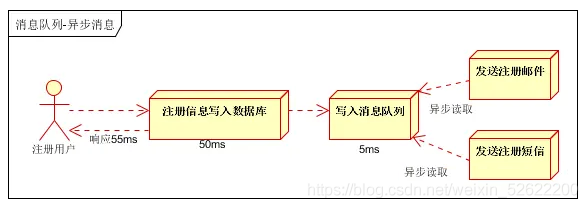
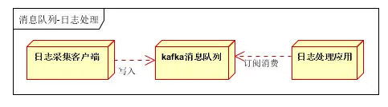
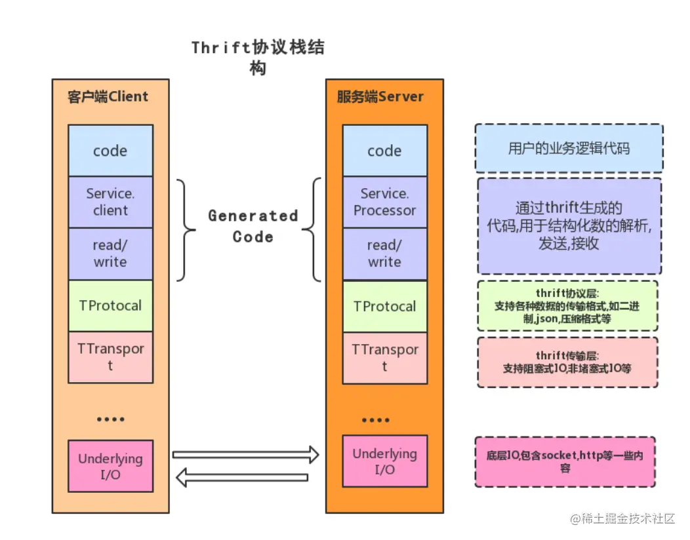
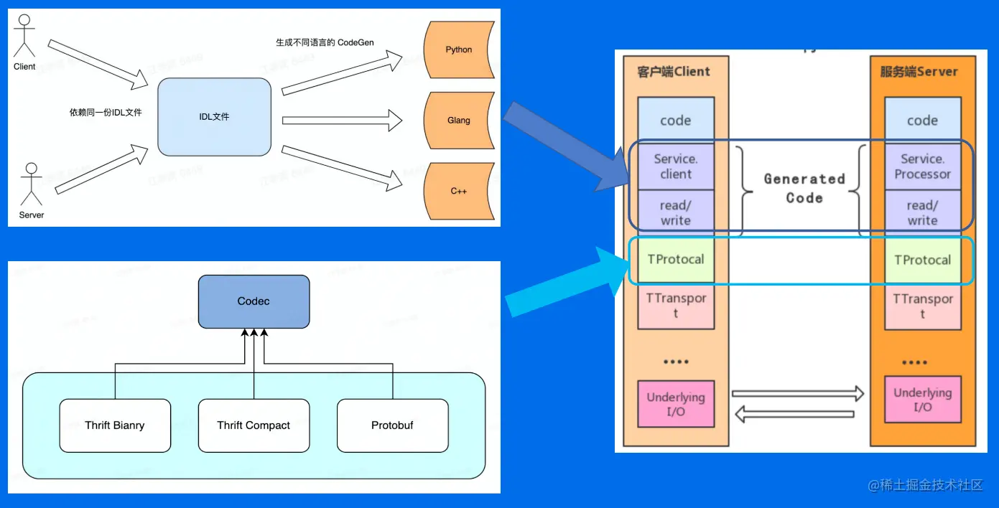
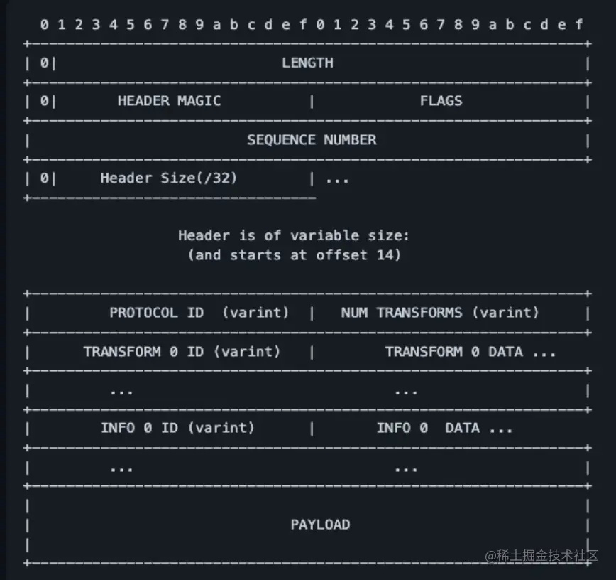
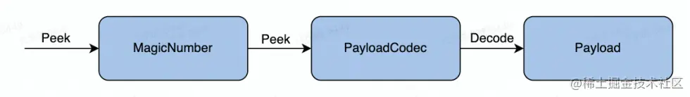
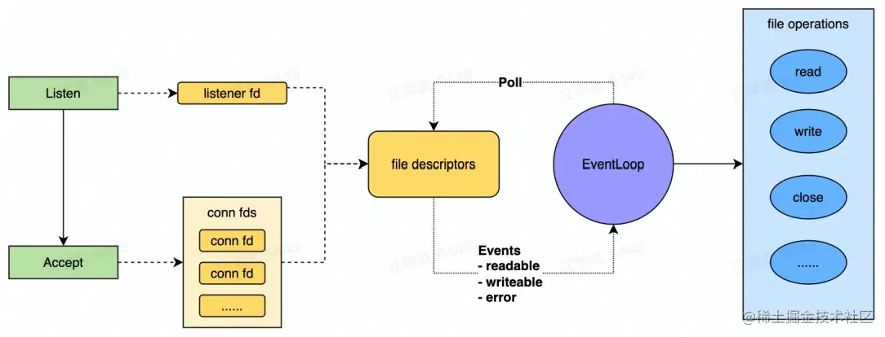

## 消息队列

消息队列中间件是[分布式系统](https://so.csdn.net/so/search?q=分布式系统&spm=1001.2101.3001.7020)中重要的组件，主要解决应用解耦，异步消息，流量削锋等问题，实现高性能，高可用，可伸缩和最终一致性架构。目前使用较多的消息队列有ActiveMQ，RabbitMQ，ZeroMQ，Kafka，MetaMQ，RocketMQ

### 消息队列是什么

*   解耦

订单系统：用户下单后，订单系统完成持久化处理，将消息写入消息队列，返回用户订单下单成功

库存系统：订阅下单的消息，采用拉/推的方式，获取下单信息，库存系统根据下单信息，进行库存操作

假如：在下单时库存系统不能正常使用。也不影响正常下单，因为下单后，订单系统写入消息队列就不再关心其他的后续操作了。实现订单系统与库存系统的应用解耦

*   削峰

流量削锋也是消息队列中的常用场景，一般在秒杀或团抢活动中使用广泛。

应用场景：秒杀活动，一般会因为流量过大，导致流量暴增，应用挂掉。为解决这个问题，一般需要在应用前端加入消息队列。

a、可以控制活动的人数

b、可以缓解短时间内高流量压垮应用

用户的请求，服务器接收后，首先写入消息队列。假如消息队列长度超过最大数量，则直接抛弃用户请求或跳转到错误页面。

秒杀业务根据消息队列中的请求信息，再做后续处理

*   异步

按照以上约定，用户的响应时间相当于是注册信息写入数据库的时间，也就是50毫秒。注册邮件，发送短信写入消息队列后，直接返回，因此写入消息队列的速度很快，基本可以忽略，因此用户的响应时间可能是50毫秒。因此架构改变后，系统的吞吐量提高到每秒20 QPS。比串行提高了3倍，比并行提高了两倍。

*   日志处理

日志处理是指将消息队列用在日志处理中，比如[Kafka](https://so.csdn.net/so/search?q=Kafka&spm=1001.2101.3001.7020)的应用，解决大量日志传输的问题。架构简化如下

  

日志采集客户端，负责日志数据采集，定时写受写入Kafka队列

Kafka消息队列，负责日志数据的接收，存储和转发

日志处理应用：订阅并消费kafka队列中的日志数据

### 消息队列的前世今生

#### 消息队列-Kafka

kafka使用场景，业务日志、用户行为数据、Metrics数据

基本概念，Producer、Cluster、Consumer、Topic、Partition

数据迁移、Offset、Partition选主

一条消息从生产到消费是如何处理的，Producer端逻辑、Broker端逻辑、Consumer端逻辑

#### 消息队列-BMQ

Kafka在使用中遇到问题

BMQ架构

BMQ各模块是如何工作的，Broker、Proxy、HDFS、MetaStorage

BMQ多机房容灾

## RPC 原理与实践

### RPC 的基本概念

RPC（Remote Procedure Call Protocol）远程过程调用协议。一个通俗的描述是：客户端在不知道调用细节的情况下，调用存在于远程计算机上的某个对象，就像调用本地应用程序中的对象一样。比较正式的描述是：一种通过网络从远程计算机程序上请求服务，而不需要了解底层网络技术的协议。

*   Client：RPC协议的调用方。就像上文所描述的那样，最理想的情况是RPC Client在完全不知道有RPC框架存在的情况下发起对远程服务的调用。但实际情况来说Client或多或少的都需要指定RPC框架的一些细节。
*   Server：在RPC规范中，这个Server并不是提供RPC服务器IP、端口监听的模块。而是远程服务方法的具体实现（在JAVA中就是RPC服务接口的具体实现）。其中的代码是最普通的和业务相关的代码，甚至其接口实现类本身都不知道将被某一个RPC远程客户端调用。
*   Stub/Proxy：RPC代理存在于客户端，因为要实现客户端对RPC框架“透明”调用，那么客户端不可能自行去管理消息格式、不可能自己去管理网络传输协议，也不可能自己去判断调用过程是否有异常。这一切工作在客户端都是交给RPC框架中的“代理”层来处理的。
*   Message Protocol：在上文我们已经说到，一次完整的client-server的交互肯定是携带某种两端都能识别的，共同约定的消息格式。RPC的消息管理层专门对网络传输所承载的消息信息进行编号和解码操作。**目前流行的技术趋势是不同的RPC实现，为了加强自身框架的效率都有一套（或者几套）私有的消息格式。**例如前文所讲到的RMI框架使用的消息协议为JRMP；后文我们将详细讲解的RPC框架Thrift也有私有的消息协议，“- Transfer/Network Protocol”（当然它还支持一些通用的消息格式，如JSON）。
*   Transfer/Network Protocol：传输协议层负责管理RPC框架所使用的网络协议、网络IO模型。例如Hessian的传输协议基于HTTP（应用层协议）；而Thrift的传输协议基于TCP（传输层协议）。传输层还需要统一RPC客户端和RPC服务端所使用的IO模型；
*   Selector/Processor：存在于RPC服务端，由于服务器端某一个RPC接口的实现的特性（它并不知道自己是一个将要被RPC提供给第三方系统调用的服务）。所以在RPC框架中应该有一种“负责执行RPC接口实现”的角色。它负责了包括：管理RPC接口的注册、判断客户端的请求权限、控制接口实现类的执行在内的各种工作。
*   IDL：实际上IDL（接口定义语言）并不是RPC实现中所必须的。但是需要跨语言的RPC框架一定会有IDL部分的存在。这是因为要找到一个各种语言能够理解的消息结构、接口定义的描述形式。如果您的RPC实现没有考虑跨语言性，那么IDL部分就不需要包括，例如JAVA RMI因为就是为了在JAVA语言间进行使用，所以JAVA RMI就没有相应的IDL。

### RPC 框架分层设计

#### 编解码层

*   数据格式
    
    *   语言特定格式：例如 java.io.Serializable
    *   文本格式：例如 JSON、XML、CSV 等
    *   二进制编码：常见有 Thrift 的 BinaryProtocol，Protobuf，实现可以有多种形式，例如 TLV 编码 和 Varint 编码
*   选型考察点
    
    *   兼容性
    *   通用型
    *   [性能](https://link.juejin.cn?target=https%3A%2F%2Fgithub.com%2Falecthomas%2Fgo_serialization_benchmarks)
    *   空间开销
    *   时间开销
*   生成代码和编解码层相互依赖，框架的编解码应当具备扩展任意编解码协议的能力
    

#### 协议层

*   以 Thrift 的 THeader 协议为例

*   协议解析

#### 网络通信层

*   阻塞 IO 下，耗费一个线程去阻塞在 read(fd) 去等待用足够多的数据可读并返回。
    
*   非阻塞 IO 下，不停对所有 fds 轮询 read(fd) ，如果读取到 n <= 0 则下一个循环继续轮询。
    

第一种方式浪费线程（会占用内存和上下文切换开销），第二种方式浪费 CPU 做大量无效工作。而基于 IO 多路复用系统调用实现的 Poll 的意义在于将可读/可写状态通知和实际文件操作分开，并支持多个文件描述符通过一个系统调用监听以提升性能。 网络库的核心功能就是去同时监听大量的文件描述符的状态变化(通过操作系统调用)，并对于不同状态变更，高效，安全地进行对应的文件操作。
