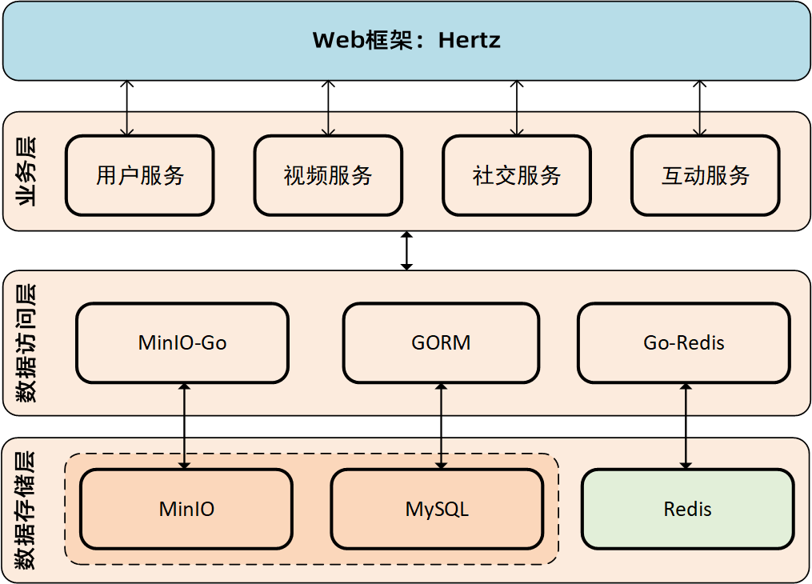
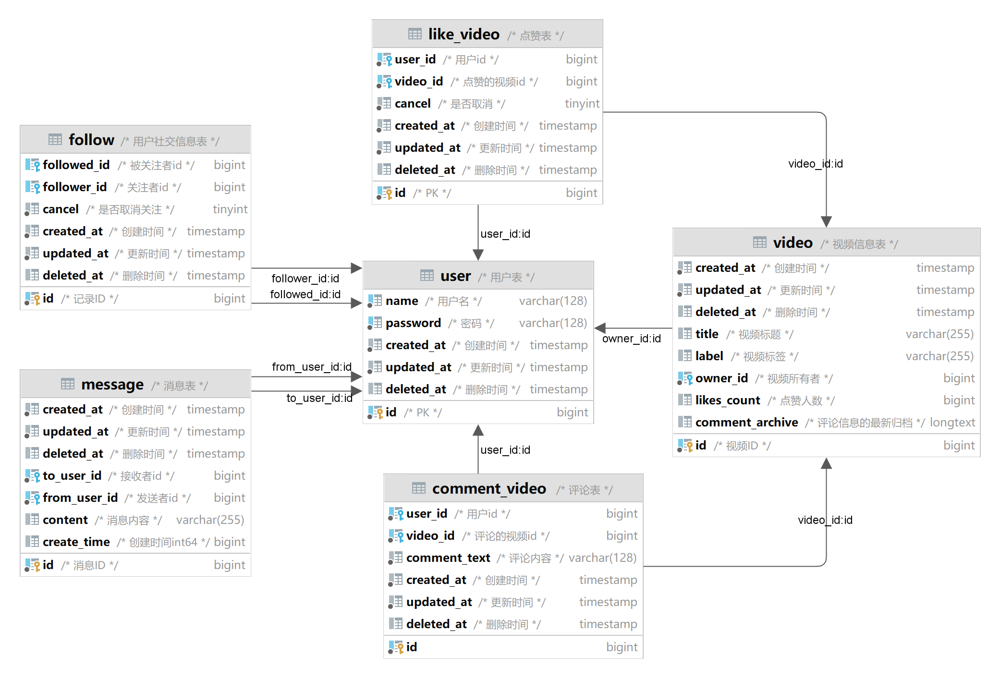
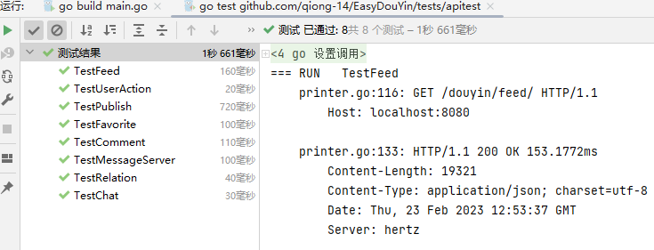

## 一、项目介绍

> 项目核心信息：简易版抖音后端服务
> 
> Github 地址：[https://github.com/qiong-14/EasyDouYin](https://github.com/qiong-14/EasyDouYin)

## 二、项目分工

| **团队成员** | **主要贡献**                                                 |
| ------------ | ------------------------------------------------------------ |
| 万禹         | 负责项目文件结构管理、用户接口、视频点赞、喜欢列表的接口设计以及对应数据库设计 |
| 韩冰         | 负责视频Feed流、用户视频上传以及对应数据库设计，minio对象储存服务，redis设计 |
| 范乃丹       | 负责用户关注操作，查询用户关注列表的接口设计以及对应数据库设计 |
| 聂嘉璐       | 负责查询用户粉丝列表，用户好友列表接口设计以及对应数据库设计 |
| 徐凯凯       | 负责JWT鉴权，redis存储userId，消息操作、聊天记录接口，Demo视频录制 |
| 袁博艺       | 负责评论功能和评论列表接口的设计与实现                       |

## 三、项目实现

### 3.1 技术选型与相关开发文档

#### 3.1.1 Web开发套件

*   **[Hertz](https://github.com/cloudwego/hertz)**

现有的web开发的HTTP框架大多使用gin框架，而如今越来越多的web服务转向微服务架构，Hertz作为一个字节跳动内部的微服务HTTP框架，在设计之初参考了其他开源框架的优势，并结合字节跳动内部的需求，使其具有高易用性、高性能、高扩展性等特点，对微服务性能有着很好的提升。同时，Hertz支持包括[Autotls](https://github.com/hertz-contrib/autotls), [Http2](https://github.com/hertz-contrib/http2)等各种扩展，更加利于用户的不同定制化的需求。

*   **[GORM](https://github.com/go-gorm/gorm)**

gorm框架作为golnag语言一款性能极好的ORM库，支持多种数据库。使用起来简单方便，支持链式操作和原生SQL，对开发人员相对友好。另外，现阶段gorm框架有良好的文档和社区支持，非常方便学习和解决问题。基于以上优点，我们选择gorm作为我们的ORM框架。

#### 3.1.2 数据库选型

关系型数据库是基于关系模型的数据库，它使用二维表来存储结构化的数据。关系型数据库适合存储需要做结构化查询、事务性、一致性的数据，比如用户的账号、地址等。剩余的数据，比如非结构化或半结构化的数据，比如图片、视频、文档等，不能存在关系型中，因为它们不适合用二维表来表示和查询。这些数据可以使用非关系型数据库来存储，比如HBase、Cassandra、Redis等。在本项目中，有关用户关系、视频信息（不包括视频文件本身）的内容都可以用关系型数据库来储存，而视频文件就需要文件系统辅助存储。因此我们选用Mysql来存储用户信息、视频信息、用户视频关系、用户关注关系、聊天信息结构化的数据，并用Redis对部分数据进行缓存。

#### 3.1.3 对象存储服务的应用

视频的元信息需要持久化存储到关系型数据库, 包括视频的标题、封面、所有者、视频的标签以及当前的状态(待审核、已审核待上线、待修改、已删除)。

视频的封面和视频本身属于超大的不定规模的二进制数据, 可以存到文件系统中, 以FTP或基于FTP的方式向外访问, 但这种方式有很多弊端, 比如视频链接可能会长期有效, 给服务器造成很大负担, 如果视频被删除, 需要同步删除视频本身以避免视频泄露, 以及潜在的FTP安全漏洞.

基于以上考量, 这样的二进制数据存储到对象存储服务, 如MinIO中. 经过了解, Minio可以产生仅在一段时间内有效的URL传递到前端. [MinIO官方](https://www.minio.org.cn/)也有[Go的SDK](https://github.com/minio/minio-go)方便开发者使用.

#### 3.1.4 Redis对MySQL慢查询的补充

### 3.2 架构设计

### 3.3 项目代码介绍

### 

| 目录            | 文件        | 说明                                                     |
| --------------- | ----------- | -------------------------------------------------------- |
| biz/handler/    |             | 路由处理函数                                             |
| 基础接口        | feed.go     | **视频流接口**                                           |
|                 | user.go     | **用户注册** **用户登录** **用户信息**         |
|                 | publish.go  | **视频投稿** **发布列表**                           |
| 互动接口        | comment.go  | **评论操作** **评论列表**                           |
|                 | favorite.go | **赞操作** **喜欢列表**                             |
| 社交接口        | message.go  | **聊天记录** **消息操作**                           |
|                 | relation.go | **关系操作** **用户关注列表** **用户好友列表** |
| biz/resp/       | common.go   | 响应结构体定义                                           |
| biz/router      | register.go | 路由注册                                                 |
| configs/sql     | init.sql    | 数据库初始化语句                                         |
| constants/      | constant.go | 项目中定义的常量内容                                     |
| dal/            |             | 数据库相关内容                                           |
|                 | init.go     | 数据库初始化                                             |
|                 | comment.go  | 评论表 comment                                           |
|                 | like.go     | 点赞表 like_video                                        |
|                 | message.go  | 消息表 message                                           |
|                 | relation.go | 社交表 follow                                            |
|                 | user.go     | 用户表 user                                              |
|                 | video.go    | 视频表 video                                             |
| middleware/jwt/ | jwt.go      | jwt鉴权                                                  |
|                 | minio.go    | minio对象储存服务                                        |
|                 | redis.go    | redis缓存                                                |
| service/        | user.go     | 带缓存的用户操作接口                                     |
|                 | video.go    | 带缓存的视频操作接口                                     |
| tools/          | common.go   | 项目公用函数                                             |
| ./              | main.go     | 项目入口                                                 |

### 3.4 数据库表设计

以上为数据库表的关系图，根据功能设计我们设计了六张表，红色为主表，其他表基于这两张表来拓展功能：

|       表名        |            用途            |  关联的表  |                        主要键及其作用                        |
| :---------------: | :------------------------: | :--------: | :----------------------------------------------------------: |
|     **user**      |      储存用户名和密码      |            |        name 用户名（账号）password 用户密码（加密后）        |
|     **video**     |      储存视频相关信息      |            | owner_id 视频作者idtitle 视频标题label 视频标签likes_count 点赞人数 |
|  **like_video**   |  储存用户对视频的点赞信息  | user video |             user_id 用户idvideo_id 点赞的视频id              |
| **comment_video** |  储存用户对视频的评论信息  | user video |             user_id 用户idvideo_id 评论的视频id              |
|    **message**    | 储存用户之间发送的消息信息 |    user    | from_user_id 发送消息用户idto_user_id 接受消息用户idcontent 消息内容 |
|    **follow**     |   储存用户之间的关注信息   |    user    |          followed_id 被关注用户idfollow_id 关注者id          |

### 3.5 用户名验证和密码强度评估

对于用户注册时输入的用户名和密码我们可以在后端进行进行验证，如果用户名不符合特定格式不允许用户进行注册（本项目使用的是邮箱格式，只有符合邮箱格式的用户名才能通过注册），以及对于密码强度较弱的用户拒绝注册。采用正则表达式匹配用户名和密码字符串实现以上功能。

| 分数         | 0      | 2                   | 3                            | 5                               | 10         | 15   | 20        | 25   |
| ------------ | ------ | ------------------- | ---------------------------- | ------------------------------- | ---------- | ---- | --------- | ---- |
| 密码长度     | <8     |                     |                              | 5~8                             |            | 8~10 |           | >=10 |
| 英文大小写   | 无字母 |                     |                              |                                 | 大写或小写 |      | 大写+小写 |      |
| 数字个数     | 无数字 |                     |                              |                                 | 1~3        |      | >=3       |      |
| 特殊字符个数 |        |                     |                              |                                 | 1          |      |           | >1   |
| 奖励分       |        | 数字+字母大写或小写 | 数字+特殊字符+字母大写或小写 | 数字+特殊字符+字母大写+字母小写 |            |      |           |      |

## 四、测试结果

**通过demo的测试函数进行功能测试：**

## 五、项目总结与反思

> 1.  目前仍存在的问题
> 2.  已识别出的优化项
> 3.  架构演进的可能性
> 4.  项目过程中的反思与总结

从刚开始的完全不了解go语言到项目的完成，我们组遇到过不少的困难，但是最终还是坚持完成了项目。总结来说，本项目完整的实现所有的服务功能，由于时间和阅历的问题，项目也存在些许不足之处：

1.  微服务架构方面，采用了Hertz架构为以后扩展微服务进行了准备，当前业务还是耦合性较强，不利于业务细化。
2.  对于高并发场景：数据库方面只使用了redis缓存进行优化，没有进行分库分表，分区操作，读写分离等，服务器方面没有采用消息队列，负载均衡等方法
