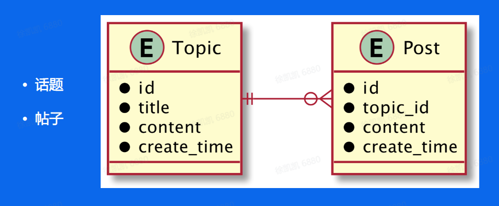
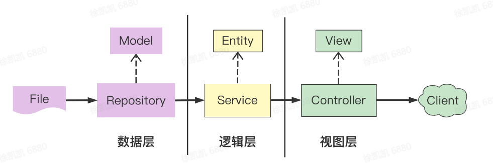
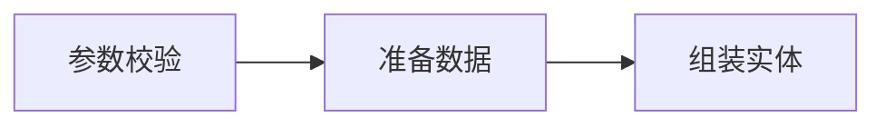
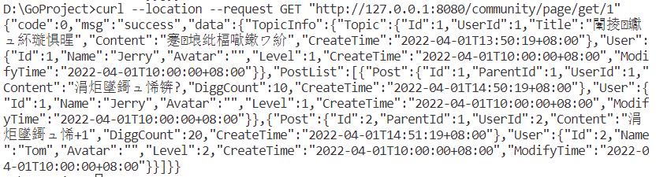

## 一、本堂课重点内容：

本节课程主要分为四个方面：

*   语言进阶
    
*   依赖管理
    
*   单元测试
    
*   项目实战
    

## 二、详细知识点介绍：

### 语言进阶

#### Goroutine

协程：用户态，轻量级线程，栈KB级别

线程：内核态，线程跑多个协程，栈MB级别

*   CSP(Communicating Sequential Processes)

提倡**通过通信共享内存**而不是通过共享内存而实现通信

#### Channel

make(chan 元素类型,\[缓存大小\])

无缓冲通道 make(chan int)

有缓存通道make(chan int,2) 生产·消费问题

#### 并发安全 Lock

var lock sync.Mutex

通过lock.Lock()和lock.Unlock()实现协程的互斥操作，达到并发安全

#### WaitGroup

计数器：开启协程+1；执行结束-1；主协程阻塞直到计数器为0

```go
//快速打印hello goroutine：0-4
func hello(i int) {
    println("hello world : " + fmt.Sprint(i))
}
//不使用WaiGroup
func HelloGoRoutine() {
    for i := 0; i < 5; i++ {
        go func(j int) {
            hello(j)
        }(i)
    }
    time.Sleep(time.Second)
}
//使用WaiGroup更优雅
func ManyGoWait() {
    var wg sync.WaitGroup
    wg.Add(delta:5)
    for i := 0; i < 5; i++ {
        go func(j int) {
            defer wg.Done()
            hello(j)
        }(i)
    }
    wg.Wait()
}
```

### 依赖管理

#### 背景

工程项目不可能基于标准库0-1编码搭建，更加注重逻辑层面编码，因此要依赖管理

#### Go依赖管理演进

**GOPATH->Go Vendor->Go Module**

不同环境（项目）依赖的版本不同，要控制依赖库的版本

1.环境变量$GOPATH

```
$GOPATH
├── bin //项目编译的二进制文件
├── pkg //项目编译的中间产物，加速编译
└── src //项目源码
```

弊端：若场景A和B依赖于某一package的不同版本，无法实现package的多版本控制

项目代码直接依赖src下的代码

go get下载最新版本的包到src目录下

2.GoVender

弊端：无法控制依赖的版本。更新项目又可能出现依赖冲突，导致编译出错。

3.GoModule

可以定义规则管理关系。

#### Go Module实践

依赖管理三要素

1.  配置文件，描述依赖 go.mod

version:

语义化版本`${MAJOR}.${MINOR}.${PATCH}`

基于commit伪版本`vX.0.O-yyyymmddhhmmss-abcdefgh1234`(时间戳+哈希码)

2.  中心仓库管理依赖库 Proxy
    
3.  本地工具 go get/mod
    

go mod:

init 初始化，创建go.mod文件 download 下载模块到本地缓存 tidy 增加需要的依赖，删除不需要的依赖

### 单元测试

#### 规则：

*   所有测试文件以\_test.go 结尾
*   func TestXxx(\*testing.T)
*   初始化逻辑放到TestMain中

可以增加--cover参数来显示覆盖率

#### Mock

常用 monkey : [github.com/bouk/monkey](https://link.juejin.cn/?target=https%3A%2F%2Fgithub.com%2Fbouk%2Fmonkey)

#### 基准测试

基准测试用于对代码进行性能分析。

以Benchmark开头，Resttimer重置计时器，runparallel是多协程并发测试。

在并发情况下rand为了保证并发安全和随机性有了全局锁，性能下降，可以使用fastrand提升性能。

## 三、实践练习例子-青训营话题页开发：

### 需求描述

*   展示话题（标题，文字描述）和回帖列表
*   暂不考虑前端页面实现，仅仅实现一个本地web服务
*   话题和回帖数据用文件存储

### ER图

1个话题可以对应多个帖子，但一个帖子只能属于一个话题。



### 分层结构



数据层：数据Model，外部数据的增删改查

逻辑层：业务Entity，处理核心业务逻辑输出

视图层：视图View，处理和外部的交互逻辑

### 组件工具

Gin高性能go web框架

[https://github.com/gin-gonic/gin#installation](https://github.com/gin-gonic/gin#installation)

Go mod

go mod init

go get gopkg.in/gin-gonic/gin.v1@v1.3.0

### Repository

```json
// Topic
{
    "id":1,
    "title":"青训营来啦！",
    "content":"欢迎踊跃报名！",
    "create_time":100213123123
}

// Post
{
    "id":1,
    "parent_id":1,
    "content":"欢迎欢迎！",
    "create_time":2131312
}
```

以下代码中用到了sync.once，主要适用高并发的场景下只执行一次的场景，这里的基于once的实现模式就是我们平常说的单例模式，减少存储的浪费。

```go
var topicDao *TopicDao
var topicOnce sync.Once

func NewTopicDaoInstance() *TopicDao {
    topicOnce.Do(
        func() {
            topicDao = &TopicDao{}
        })
    return topicDao
}
```

### Service

首先定义service实体

```go
type PageInfo struct {
    TopicInfo *TopicInfo
    PostList  []*PostInfo
}
```

代码流程编排



话题信息和回帖信息都依赖topicid，可以并行查询，提高执行效率。一定要多思考是否可以并行，通过压榨CPU，降低接口耗时，不要一味的串行实现，浪费多核CPU的资源。

```go
func (f *QueryPageInfoFlow) prepareInfo() error {
    //获取topic信息
    var wg sync.WaitGroup
    wg.Add(2)
    go func() {
        defer wg.Done()
        //
    }()
    //获取post列表
    go func() {
        defer wg.Done()
        //
    }()
    wg.Wait()
    return nil
}
```

### View

下面就是controller层。这里我们定义一个view对象，通过code msg 打包业务状态信息，用data承载业务实体信息

```go
type PageData struct {
    Code int64       `json:"code"`
    Msg  string      `json:"msg"`
    Data interface{} `json:"data"`
}
```

### 运行测试

成功得到返回结果（中文乱码，问题不大。。



## 四、课后个人总结：

本次课程知识点较多，需要慢慢消化吸收。

仅仅是跟着老师实现一遍，还是遇到很多的问题，但是开发流程有了一定了解。

还有课后实践没有完成：

*   支持发布帖子。
*   本地id生成需要保证不重复、唯一性。
*   Append文件，更新索引，注意Map的并发安全问题。
