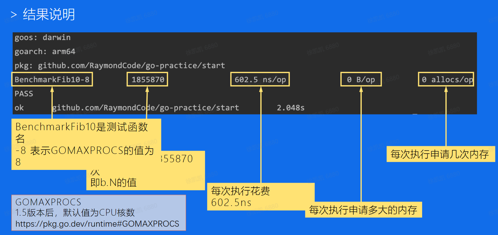
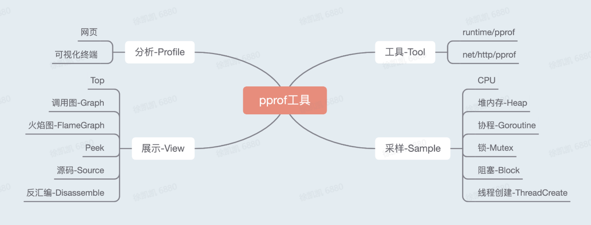

## 一、高质量编程：

### 高质量编程简介

#### 高质量代码

*   各种边界条件考虑完备
*   异常情况处理，稳定性保证
*   易读易维护

#### 编程原则

*   简单性：简单清晰的逻辑
*   可读性：确保代码可读
*   生产力：团队整体工作效率非常重要

### 编码规范

#### 代码格式

推荐自动格式化代码

#### 注释

**公共符号始终要注释**

*   解释代码作用
*   解释代码如何做的
*   解释代码实现的原因
*   解释代码什么情况会出错

#### 命名规范

*   注意变量的作用域来确定变量名表达的信息量
*   package 只由小写字母组成，不可与标准库同名
*   重点考虑上下文信息，设计简洁清晰的名称

#### 控制流程

*   保持正常代码路径为最小缩进，优先处理错误情况来减少嵌套
*   故障问题大多出现在复杂的条件语句和循环语句中

#### 错误和异常处理

**error**

*   简单错误：仅出现一次且不被其他地方捕获的错误用`errors.New`表示
*   `fmt.Errorf`生成error错误链，方便定位error
*   判定一个错误是否为特定错误：`errors.Is`
*   在错误链上获取特定种类的错误：`errors.As`

**panic**

*   当程序启动阶段发生不可逆转的错误时，可以在init或main函数中使用panic
*   若问题可以被屏蔽或解决，使用error代替panic

**recover**

*   嵌套无法生效
*   生效范围在当前goroutine的被defer的函数中生效

### 性能优化建议

#### Benchmark

`go test -bench. -benchmem`

#### Slice

*   预分配空间效率更高
*   切片操作并不复制切片指向的元素
*   创建一个新的切片会复用原来切片的底层数组
*   使用从copy代替re-slice，防止大切片被小切片引用而不能释放
*   map与slice类似

#### 字符串

*   拼接：`strings.Builder<bytes.Buffer< +`
*   使用+拼接，每次都会重新分配内存，其余两种不会

#### 空结构体

*   空结构体`struct{}`实例不占据任何内存空间
*   空结构体本身具备很强的语义，不需要任何值，仅作为占位符
*   Set可以由map代替，只使用map的键，不用值

#### atomic/mutex

*   硬件实现，效率比锁高。锁的实现属于系统调用
*   sync.Mutex，应该用来保护一段逻辑，不仅仅保护一个变量

## 二、性能优化实战

### 性能分析工具pprof

#### 简介

#### pprof-排查实战

*   搭建pprof实践项目，来自[GitHub-go-pprof-practice](https://github.com/wolfogre/go-pprof-practice)
    
*   项目提前埋入一些炸弹代码，产生可观测的性能问题
    
*   CPU、堆内存、协程、锁、阻塞均有涉及
    

### 性能调优案例

从业务服务优化、基础库优化、Go语言优化三个方面展开

## 三、课后个人总结：

高质量编码需要大量的积累，我平常写代码尽量符合高质量编程原则，养成好的编码习惯，此外性能分析工具pprof需要在实战一步步掌握排查方法，仅仅靠一个案例是不够的。我会反复夯实基础课程，为后面的进阶课程做好准备。
