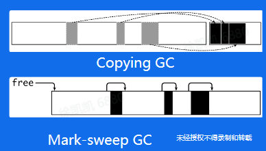
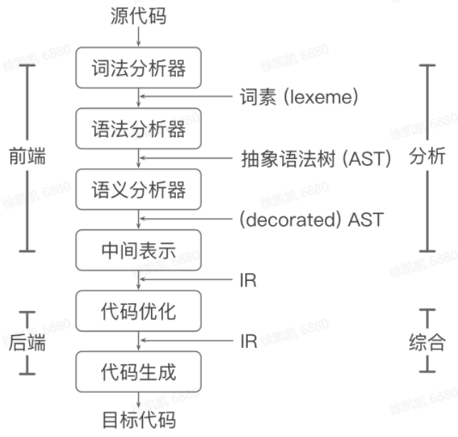
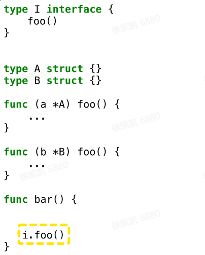

## 一、自动内存管理：

### 概念

自动内存管理（垃圾回收Garbage Collector）：由程序语言的运行时系统管理动态内存

避免手动，专注于业务逻辑

保证内存使用的**正确性**和**安全性**

#### 三个任务

*   为新对象分配空间
*   找到存活对象
*   回收死亡对象的内存空间

#### 相关概念

*   Mutator: 业务线程，分配新对象，修改对象指向关系
*   Collector: GC线程，找到存活对象，回收死亡对象的内存空间
*   Serial GC: 只有一个collector
*   Parallel GC: 支持多个collectors同时回收的GC算法
*   Concurrent GC: mutator(s)和collector(s)可以同时执行
*   Collectors 必须感知对象指向关系的改变
*   Tracing garbage collection: 追踪垃圾回收
*   Reference counting: 引用计数
*   评价指标：安全、吞吐率、暂停时间、内存开销

### 追踪垃圾回收

#### 回收条件

指针指向关系不可达的对象

#### 回收过程

标记根对象-标记找到可达对象-清理所有不可达对象

根据对象的生命周期，使用不同的标记和清理策略

### 分代GC(Generational GC)

对年轻和老年的对象，制定不同的GC策略，降低整体内存管理的开销

不同年龄的对象处于heap的不同区域

#### 年轻代

由于存活对象很少，可以采用copying collection

#### 老年代

对象趋向于一直活着，反复复制开销较大，可以采用mark-sweep-collection

### 引用计数

对象存活条件：当且仅当引用数大于0

#### 优点

内存管理操作被平摊到程序执行过程中

不需要了解runtime的实现细节

#### 缺点

开销大，通过原子操作保证原子性和可见性

无法回收环形数据结构

回收内存时依然可能引发暂停

## 二、Go 内存管理及优化

### Go 内存分配

**缓存**

TCMalloc:thread caching

*   每个p包含一个mcache用于快速分配，用于为绑定于p上的g分配对象
*   mcache管理一组mspan
*   当mcache中的mspan分配完毕，向mcentral申请带有未分配块的mspan
*   当mspan中没有分配的对象，mspan会被缓存在mcentral中，而不是立刻释放并归还给OS

### Go 内存管理优化

对象分配是非常高频的操作：每秒分配GB级别的内存

**优化方案**

Balanced GC

Goroutine allocation buffer(GAB)对于Go内存管理来说是一个大对象

将多个小对象的分配合并成一次大对象的分配

实现了copying GC

## 三、编译器和静态分析

### 编译器的结构

### 静态分析

不执行程序的代码，推导程序的行为，分析程序的性质

控制流：程序执行的流程

数据流：数据在控制流上的传递

### 过程内和过程间分析

过程内分析(Intra-procedural analysis) 仅在函数内部进行分析 过程间分析(Inter-procedural analysis)

考虑函数调用时参数传递和返回值的数据流和控制流

*   需要通过数据流分析得知1的具体类型，才能知道1.foo()调用的 是哪个foo()
*   根据1的具体类型，产生了新的控制流，1.foo(),分析继续
*   过程间分析需要同时分析控制流和数据流一一联合求解，比较复杂

## 四、Go 编译器优化

#### 函数内联

消除函数调用开销

将过程间分析转化为过程内分析，帮助其他优化，例如逃逸分析

micro-benchmark验证可得性能提升明显

#### Beast Mode

调整函数内联的策略，使更多的函数被内联

#### 逃逸分析

分析代码中指针的动态作用域：指针在何处可以被访问

## 五、课后个人总结：

本次课程内容非常的偏向语言底层，需要一定编译原理的基础，有利于更好地理解。如今编译器优化还有很大的发展空间，课后有空多多阅读相关知识点
