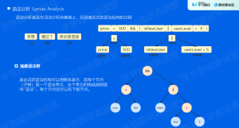

## 一、认识规则引擎

### 定义

嵌入在应用中的组件，将业务决策从应用中抽离出来，并使用预定义的语义编写决策。接受数据输入，解释业务规则，做出决策

### 组成

数据输入 -- 支持接受使用预定义的语义编写的规则作为策略集，接受业务的数据作为参数

规则理解 -- 按预先定义的词法正确理解业务规则的语义

规则执行 -- 类型检查

### 应用场景

风控对抗

活动运营

数据分析及数据清洗

## 二、编译原理

### 词法分析

把源代码字符串转化为词法单元Token

基于有限自动机，状态转换

### 语法分析

在词法分析的基础上，识别语法结构

基于抽象语法树（上下文无关语法）



### 类型检查

综合检查

*   根据子表达式构造父表达式的类型

运行/编译时检查

*   编译时提前声明
*   执行时根据传入的参数的类型，在执行过程中检查

## 三、设计一个规则引擎

### 设计目标

设计一个规则引擎，支持特定的词法、运算符、数据类型和优先级。并且支持基于以上预定义语法的规则表达式的编译和执行。

*   词法分析
*   运算符
*   数据类型
*   优先级

### 词法分析

```
参数：由字母数字下划线组成eg:_ab2、user_name
布尔值：true、false
字符串："abcd"、'abcd'、`abcd`
十进制int:1234
十进制float:123.5
一元运算符：+ -
二元运算符：+ - * / % > < >= <= == !=
逻辑操作符：&&  !
括号：()
```

### 语法分析

*   优先级的表达
*   语法树结构
*   递归下降

### 语法树执行与类型检查

*   语法树执行 -- 后续遍历
*   类型检查 -- 在节点左右子节点执行完成后分别校验类型是否符合预设

## 四、实现规则引擎

项目地址：[简单的规则引擎](https://link.juejin.cn?target=https%3A%2F%2Fgithub.com%2Fqimengxingyuan%2Fyoung_engine)

运行：

```bash
docker-compose up
go run ./main.go
```

默认端口是 `:8888` 测试一下

```go
func Compiler(exp string) (*executor.Node, error) {
    // 扫描语句
    tokenScanner := compiler.NewScanner(exp)
    // 词法分析
    tokens, err := tokenScanner.Lexer()
    if err != nil {
        return nil, err
    }
    // 语法分析
    parser := compiler.NewParser(tokens)
    err = parser.ParseSyntax()
    if err != nil {
        return nil, err
    }
    // 优先级判断
    astBuilder := compiler.NewBuilder(parser)
    ast, err := astBuilder.Build()
    if err != nil {
        return nil, err
    }

    return ast, nil
}
```

## 五、总结

本次课程内容非常的偏向语言底层，需要一定编译原理的基础，有利于更好地理解。课后有空多多阅读代码，实现一个web版规则引擎
