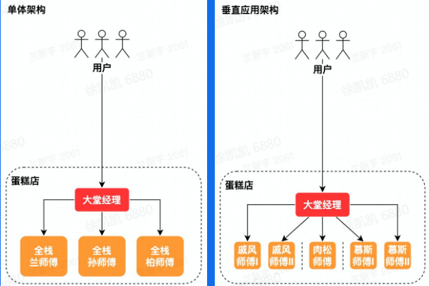
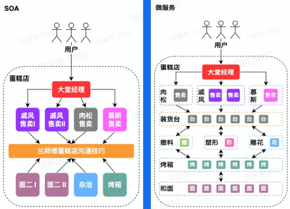
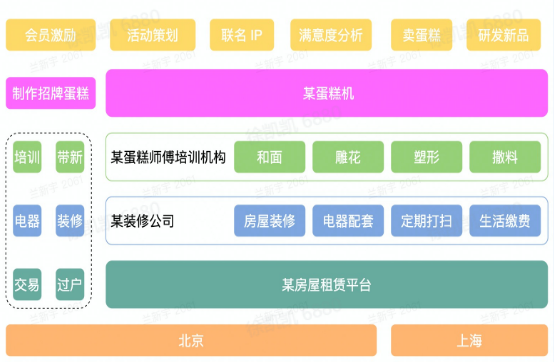
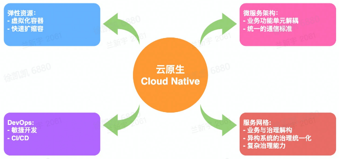

## 一、什么是架构

### 定义

有关软件整体结构与组件的抽象化描述

### 架构演进

*   单机架构
    
    把所有功能实现在一个进程里，部署在一台机器上
    
    优点：简单，只有简单
    
*   单体架构，垂直切分
    
    分布式部署，按应用垂直切分单体
    
    优点：水平扩容，运维不需要停服
    
    
    
*   **SOA(Service-Oriented Architecture)，微服务**
    
    把功能抽象为不同服务，并且每个服务之间有通讯标准但是soa和微服务还是有不同的，在于通讯方式，数据库设计和服务规模
    
    优点：1.不同模块的RD可以专心于自己的业务逻辑了，开发迭代效率得到显著提高
    
    2.各个服务独立运维，变更操作的影响面可控，应用整体的稳定性得到了提高
    
    
    

## 二、企业级后端架构剖析

### 云计算

**IaaS：Infrastructure as a Service（基础设施即服务）**

*   买房子vs房屋租赁平台

从上面的架构图可以看出，IaaS处于最底层，服务商提供底层/物理层基础设施资源（服务器，数据中心，环境控制，电源，服务器机房），客户自己部署和执行操作系统或应用程序等各种软件。

**PaaS：Platform as a Service（平台即服务）**

*   清包vs全包

PaaS处于中间层，服务商提供基础设施底层服务，提供操作系统（Windows，Linux）、数据库服务器、Web服务器、域控制器和其他中间件，以及服务模型中的备份服务等中件层服务。例如IIS，.NET，Apache，MySQL …，客户自己控制上层的应用程序部署与应用托管的环境。

**SaaS：Software as a Service（软件即服务）**

*   从零培训vs雇佣培训过的师傅

SaaS处于最上层，服务商提供基于软件的解决方案，满足客户最终需求；如OA、CRM、MIS、ERP、HRM、CM、Office 365、iCloud、G Suite等应用，客户不需考虑任何形式的专业技术知识，获得完整的软件包，使他们的日常工作和生活变得更轻松。

**FaaS：Function as a service（函数即服务）**

*   纯手工制作vs蛋糕机批量生产

服务商提供一个平台，允许客户开发、运行和管理应用程序功能，而无需构建和维护通常与开发和启动应用程序相关的基础架构的复杂性。 按照此模型构建应用程序是实现“无服务器”体系结构的一种方式，通常在构建微服务应用程序时使用。

### 云原生

云原生是一种**构建和运行应用程序的方法**

云原生主要涉及四个方面：**DevOps，弹性资源，微服务架构，服务网格**

****

## 三、企业级后端架构的挑战

### 离在线资源并池

**在线业务的特点**

*   IO密集型为主
*   潮汐性、实时性

**离线业务的特点**

*   计算密集型占多数
*   非实时性

### 自动扩缩容

利用在线业务潮汐性自动扩缩容来降低业务成本

### 微服务亲和性部署

*   将满足亲合性条件的容器调度到一台宿主机
*   微服务中间件与服务网格通过共享内存通信
*   服务网格控制面实施灵活、动态的流量调度

### 流量治理

基于微服务中间件&服务网格的流量治理

提高容错性、容灾

### CPU水位负载均衡

**Iaas**

提供资源探针

**服务网格**

动态负载均衡

## 四、总结

没有最好的架构，只有最合适的架构。

学习架构设计的过程以及其中的问题，可以很好帮助我们理解项目的构建的目的、过程。让我的思维更加全面，目光更加长远。
