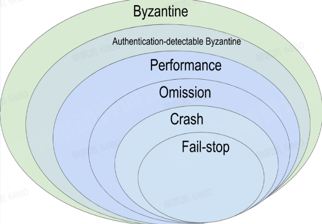

## 一、分布式概述

### 什么是分布式

分布式系统是计算机程序的集合，这些程序利用跨多个独立计算节点的计算资源来实现共同的目标。可以分为分布式计算、分布式存储、分布式数据库等。

优势：

*   去中心化
*   低成本
*   弹性
*   资源共享
*   可靠性高

挑战：

*   普遍的节点故障
*   不可靠的网络
*   异构的机器与硬件环境
*   安全

## 二、系统模型

### 故障模型：

*   Byzantine failure:节点可以任意篡改发送给其他节点的数据
    
*   Authentication detectable byzantine failure
    
    (ADB):Byzantine failure的特例;节点可以篡改数据，但不能伪造其他节点的数据
    
*   Performance failure:节点未在特定时间段内收到数据，即时间太早或太晚
    
*   Omission failure:节点收到数据的时间无限晚，即收不到数据
    
*   Crash failure:在omission failure的基础上，增加了节点停止响应的假设，也即持续性地omission failure
    
*   Fail-stop failure:在Crash failure的基础上增加了错误可检测的假设
    

### 拜占庭将军问题

由于当时拜占庭罗马帝国国土辽阔，为了达到防御目的，每个军队都分隔很远，将军与将军之间只能靠信差传消息。在战争的时候，拜占庭军队内所有将军和副官必须达成一致的共识，决定是否有赢的机会才去攻打敌人的阵营。但是，在军队内有可能存有叛徒和敌军的间谍，左右将军们的决定又扰乱整体军队的秩序。在进行共识时，结果并不代表大多数人的意见。这时候，在已知有成员谋反的情况下，其余忠诚的将军在不受叛徒的影响下如何达成一致的协议。

结论是，拜占庭将军问题是被证实无解的电脑通信问题，两支军队理论上永远无法达成共识。

TCP三次握手是在两个方向确认包的序列号，增加了超时重试，是两将军问题的一个工程解。

**思考**

1.TCP握手为什么不是两次？ 根本原因: 无法确认客户端的接收能力。

分析如下:

如果是两次，你现在发了 SYN 报文想握手，但是这个包滞留在了当前的网络中迟迟没有到达，TCP 以为这是丢了包，于是重传，两次握手建立好了连接。

看似没有问题，但是连接关闭后，如果这个滞留在网路中的包到达了服务端呢？这时候由于是两次握手，服务端只要接收到然后发送相应的数据包，就默认建立连接，但是现在客户端已经断开了，这就带来了连接资源的浪费。

2.TCP握手为什么不是四次？ 三次握手的目的是确认双方发送和接收的能力，那四次握手可以嘛？当然可以，100 次都可以。但为了解决问题，三次就足够了，再多用处就不大了。

3.TCP挥手过程中,如果FIN报文丢失,发生什么?

当客户端（主动关闭方）调用 close 函数后，就会向服务端发送 FIN 报文，试图与服务端断开连接，此时客户端的连接进入到 FIN\_WAIT\_1 状态。

正常情况下，如果能及时收到服务端（被动关闭方）的 ACK，则会很快变为 FIN\_WAIT2状态。

如果第一次挥手丢失了，那么客户端迟迟收不到被动方的 ACK 的话，也就会触发超时重传机制，重传 FIN 报文，重发次数由 tcp\_orphan\_retries 参数控制。

当客户端重传 FIN 报文的次数超过 tcp\_orphan\_retries 后，就不再发送 FIN 报文，则会在等待一段时间（时间为上一次超时时间的 2 倍），如果还是没能收到第二次挥手，那么直接进入到 close 状态。

### 共识和一致性

*   最终一致性：客户端A写完成后，其他客户端读到一致的数据
*   线性一致性：客户端A读到新值后及时同步给其他客户端，需要节点间协商，增加了延迟，系统可用性会受损

## 三、理论基础

### CAP理论

CAP理论往往应用于数据库领域，同样可以适用于分布式存储方向。

C：一致性,指数据在多个副本之间能够保持一致的特性（严格的一致性)。

A：可用性，指系统提供的服务必须一直处于可用的状态，每次请求都能获取到非错的响应———但是不保证获取的数据为最新数据。

P：分区容错性，分布式系统在遇到任何网络分区故障的时候，仍然能够对外提供满足一致性和可用性的服务,除非整个网络环境都发生了故障。

二、BASE理论 BASE理论是基于CAP理论逐步演化而来的，是CP（强一致性）和AP（强可用性）权衡的结果。 BASE理论的核心思想是：即使无法做到强一致性，但每个应用都可以根据自身业务特点采用适当的方式来使系统达到最终一致性。Basically Available（基本可用） 响应时间上的损失：正常情况下，处理用户请求需要0.5s返回结果，但是由于系统出现故障，处理用户请求的时间变成3s。 系统功能上的损失：正常情况下，用户可以使用系统的全部功能，但是由于系统访问量突然剧增，系统的非核心功能无法使用。 Soft state（软状态） 数据同步允许一定的延迟。 Eventually consistent（最终一致性） 系统中所有的数据副本，在经过一段时间的同步后，最终能够达到一个一致的状态，不要求实时。

## 四、分布式事务

二阶段提交（Two-phase Commit):为了使基于分布式系统架构下的所有节点在进行事务提交时保持一致性而设计的一种演算法。

三个假设:

1.  引入协调者(Coordinator)和参与者（Participants)，互相进行网络通信
2.  所有节点都采用预写式日志，且日志被写入后即被保持在可靠的存储设备上
3.  所有节点不会永久性损坏，即使损坏后仍然可以恢复

## 五、共识协议

Quorum NWR协议 ：是一种简化版的一致性模型

RAFT协议：保证了出现部分节点故障，也不会影响各节点，一定意义使用Quorum协议

**强调一致性！！**

## 六、课后人个总结

通过今天的学习我了解到了分布式理论，其中很多是学习数据库和计网时的知识点，分布式遇到的最大问题就是数据一致性的问题，每个理论、模型甚至协议，均致力于实现数据的一致性。
