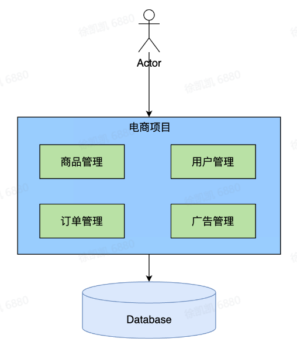
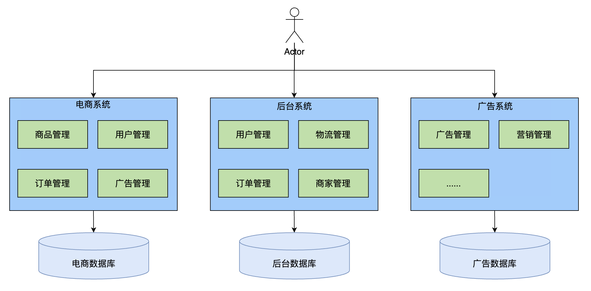
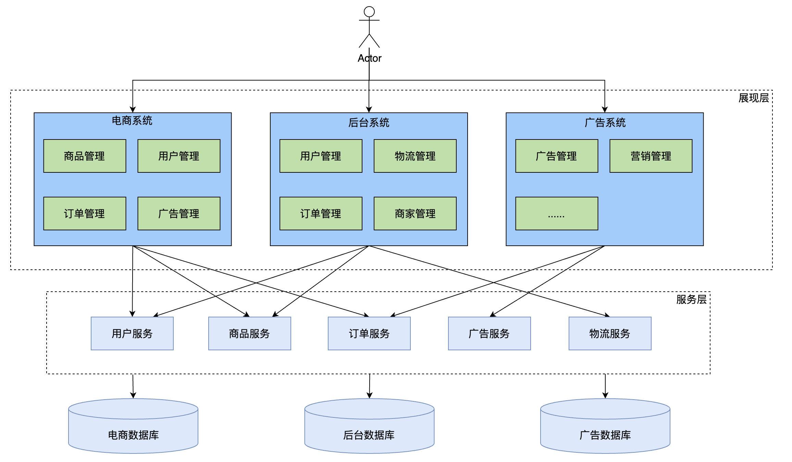
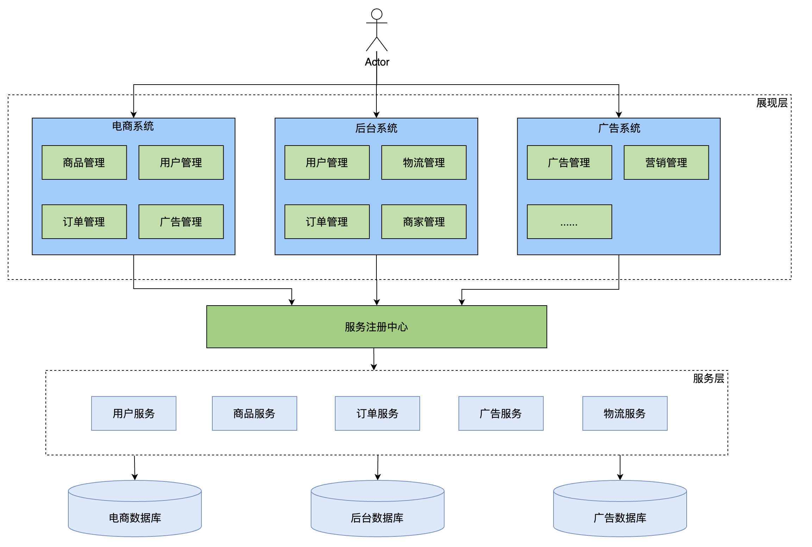
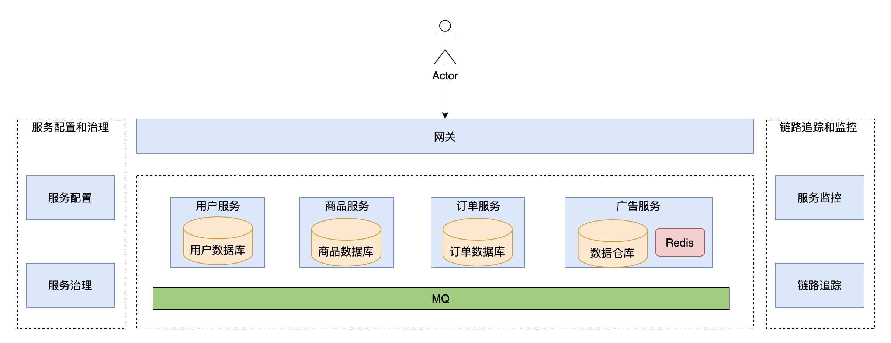
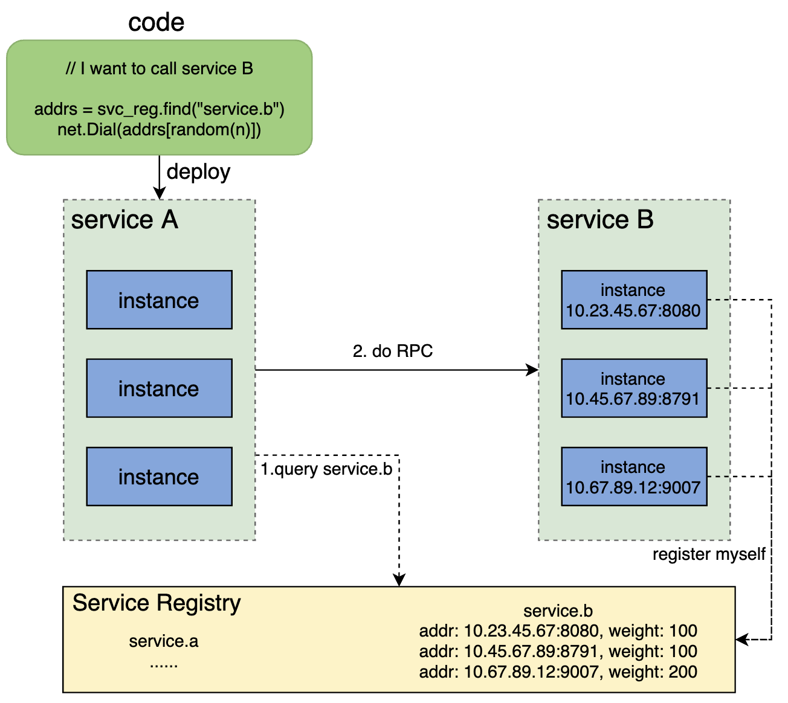
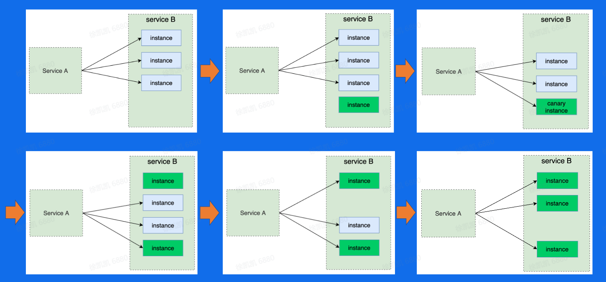

## 一、微服务架构介绍

### 系统架构演变历史

**单体架构**

优势：性能最高、冗余小

劣势：debug困难、模块相互影响、开发流程

**垂直应用架构**

优势：业务独立开发维护

劣势：不同业务单体且存在冗余

**分布式架构**

优势：业务无关的独立服务

劣势：服务模块bug可导致全站瘫痪、调用关系复杂、不同服务冗余

**SOA架构（Service Oriented Architecture）**

优势：服务注册

劣势：中心化、从上至下设计、重构困难

**微服务架构**

优势：开发效率、业务独立设计、自下而上、故障隔离

劣势：治理运维难度、观测挑战、安全性、分布式系统

### 微服务架构核心要素

*   服务治理：服务注册、服务发现、负载均衡、扩缩容、流量治理、稳定性治理
*   可观测性：日志采集、日志分析、监控打点、监控大盘、异常报警、链路追踪
*   安全：身份验证、认证授权、访问令牌、审计、传输加密、黑产攻击

## 二、微服务架构原理及特征

### 服务注册及发现

**hardcode**

hardcode的方式下指定下游实例地址的问题

服务有多个实例，没法hardcode，不同服务实例ip port本身是动态变化的，无法实现

**DNS**

问题：

*   本地DNS存在缓存、导致延时
*   负载均衡问题
*   不支持服务实例的探活检查
*   域名无法配置端口

解决思路：

新增一个统一的服务注册中心，用于存储服务名到服务实例的映射

### 流量特征

*   统一网管入口
*   内网通信多数采用RPC
*   网状调用链路

## 三、核心服务治理功能

### 服务发布

即指让一个服务升级运行新的代码的过程

**服务发布的难点**

服务不可用、服务抖动、服务回滚

灰度发布（金丝雀发布）

### 流量治理

在微服务架构下，我们可以基于地区、集群、实例、请求等维度，对端到端流量的路由路径进行精确控制

### 负载均衡

负责分配请求在每个下游实例上的分布

常见LB策略

*   Round Robin
*   Random
*   Ring Hash
*   Least Request

## 四、字节跳动服务治理实践

## 五、课后人个总结

通过今天的学习我了解到了分布式理论，其中很多是学习数据库和计网时的知识点，分布式遇到的最大问题就是数据一致性的问题，每个理论、模型甚至协议，均致力于实现数据的一致性。
