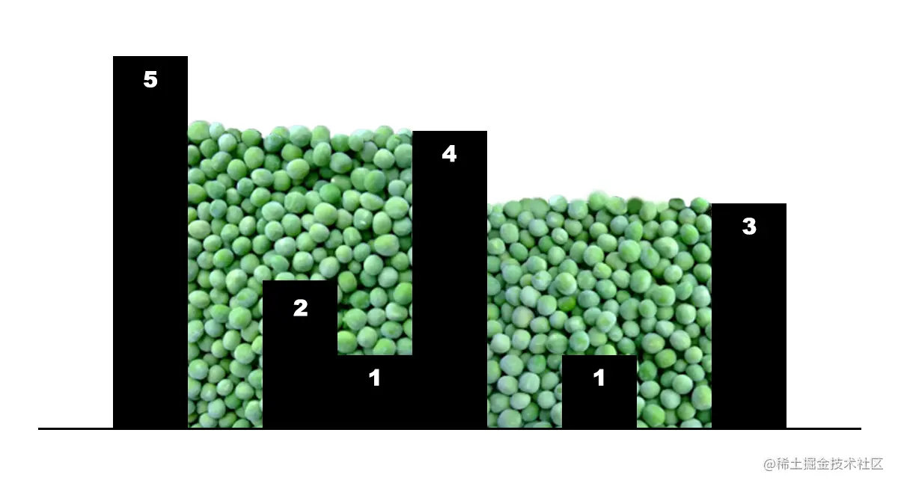
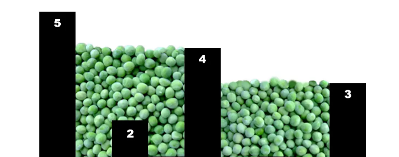

# 青训营 X 码上掘金 攒青豆 Golang

**当青训营遇上码上掘金**

## 题目描述

现有 n 个宽度为 1 的柱子，给出 n 个非负整数依次表示柱子的高度，排列后如下图所示，此时均匀从上空向下撒青豆，计算按此排列的柱子能接住多少青豆。（不考虑边角堆积）



```css
以下为上图例子的解析：

输入：height = [5,0,2,1,4,0,1,0,3]  
输出：17  
解析：上面是由数组 [5,0,2,1,4,0,1,0,3] 表示的柱子高度，在这种情况下，可以接 17 个单位的青豆。
```

## 解题思路

本人刷题用c++较多，由于本次青训营学习的语言为Golang，故采用Go来解题。

题目给出n个柱子及对应的高度，由于柱子高低不同，导致我们难以判断两个柱子之间会积攒多少青豆。但是我们如果将柱子简化到高度只有1，那么可以容易得到积攒的青豆数。

我们对上图的例子进行分析。得到第一层height1 = \[1,0,1,1,1,0,1,0,1\] ，容易得知第一层青豆数为3


之后剩余部分为 height2 = \[4,0,1,0,3,0,0,0,2\]



如此一来，我们得到了一个新的height2，我们可以通过递归求解，也可以自底向上一层一层求解。我采用了第二种。

层数

青豆数

1

3

2

5

3

6

4

3

5

0

合计

17

## 代码

[为了青豆 - 码上掘金 (juejin.cn)](https://code.juejin.cn/pen/7189615352114839612)

```go
package main

import "fmt"

func main() {
  // example :
  // n:=9
  // height := [...]int{5,0,2,1,4,0,1,0,3}
  var n int
  fmt.Scanf("%d", &n)
  height:=make([]int,1000)
  for i:= 0; i < n; i++ {
    fmt.Scanf("%d", &height[i])
  }
  sum:=0
  flag:=1
  for flag==1{
    flag=0
    count:=0
    for i := 0; i < n; i++ {
      if height[i]>0{
        if flag==0{
          flag=1
          height[i]--
        }else{
          height[i]--
          sum+=count
          count=0
        }
      }else if height[i]<=0 && flag==1{
        count++
      }
    }
  }
  fmt.Printf("青豆数:%d",sum)
}
```

## 编码注意事项

*   每一层的豆子需要由两边的柱子挡住，如果柱子数为0或1，青豆数为0，我采用flag来进行标记，flag初始为0，找到第一个柱子时flag=1，并开始计数。
*   外层循环停止条件，当遍历完数组后，flag仍为0，则表明最高层的青豆数已经计算完毕，退出循环。
*   我是从横向的角度分析青豆数，也可以从纵向的角度分析，每个柱子上方的青豆数与左侧最高柱子高度和右侧最高柱子高度中的最小值有关。
