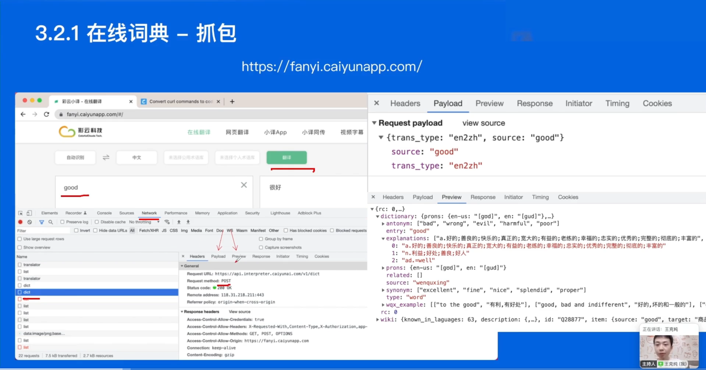
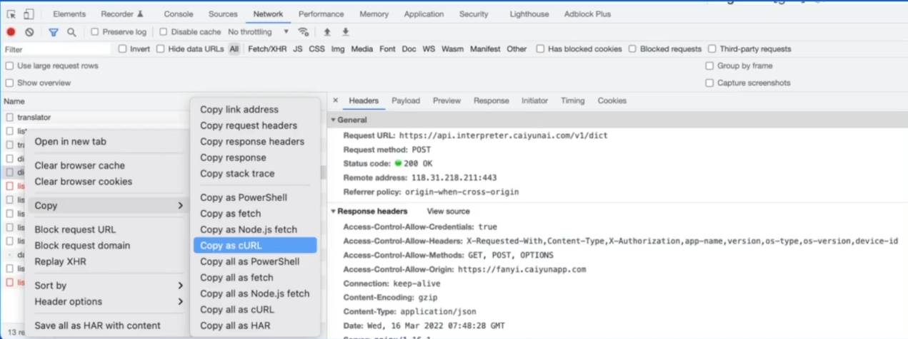
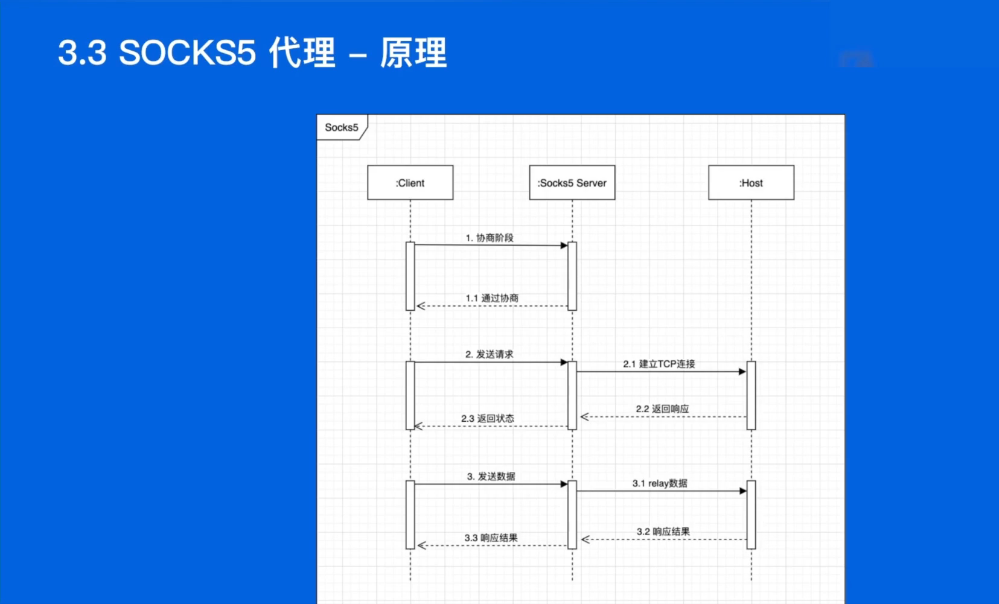
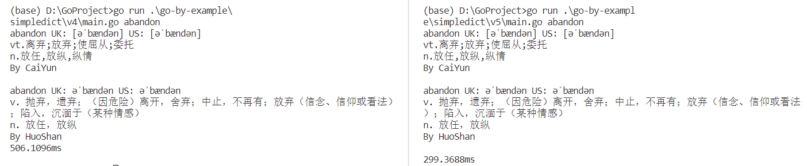

## 一、本堂课重点内容：

### Go 语言学习背景介绍

### Go 语言基础语言详细讲解

1.  开发环境
2.  基础语法
3.  标准库

### Go 语言实战

1.  项目一：猜谜游戏
2.  项目二：命令行词典
3.  项目三：SOCKS5 代理

## 二、详细知识点介绍：

### Go 语言学习背景介绍

1.  高性能、高并发
2.  语法简单、学习曲线平缓
3.  丰富的标准库
4.  完善的工具链
5.  静态链接
6.  快速编译
7.  跨平台
8.  垃圾回收

### Go 语言基础语言详细讲解

*   开发环境

开发环境选择了VScode，安装了Golang，顺利运行样例程序Hello World

*   基础语法

1.  变量

```go
var a="initial"
g:=a+"apple"
const s string = "constant"
const h = 500000
```

2.  数组

```go
var a[5]int
b:=[5]int{1,2,3,4,5}
var  towD [2][3]int
```

3.  切片

```go
s:=make([]string,3)
fmt.Println(s[2:5])
fmt.Println(s[:5])
fmt.Println(s[2:])
good:=[]string{"g","o","o","d"}
```

4.  map

```go
m:=make(map[string]int)
m["one"]=1

r,ok:=m["unknow"]
fmt.Println(r,ok) //0 false
```

5.  range

```go
nums:=[]int{2,3,4}
for i,num := range nums{
    if num==2{
        fmt.Println("index:",i,"num:",num) //index:0 num:2
    }
}
m:=map[string]string{"a":"A","b":"B"}
for k,v :=range m{
    fmt.Println(k,v) //b B;a A
}
```

## 三、实践练习例子：

### 项目一：猜谜游戏

*   生成随机数

```go
rand.seed(time.Now().UnixNano())//很重要，需用时间戳来初始化随机数种子，否则生成伪随机数
secretNumber:=rand.Intn(maxNum)
```

*   读取用户输入

```go
reader := bufio.NewReader(os.Stdin)  //输入流
input, err := reader.ReadString('\n')
input = strings.Trim(input, "\r\n")  //去除回车
guess, err := strconv.Atoi(input)  //字符转数字
```

*   实现游戏循环

```go
for {
    //···
}
```

*   实现判断逻辑

```go
if {
    //···
}else{
    //···
}
```

### 项目二：命令行词典

*   抓包

进入官网[彩云小译 - 在线翻译 (caiyunapp.com)](https://fanyi.caiyunapp.com/#/)

右键检查-Network-dict (请求 URL: [https://api.interpreter.caiyunai.com/v1/dict](https://api.interpreter.caiyunai.com/v1/dict) 请求方法: POST)



*   curl生成Go代码 [Convert curl to Go (curlconverter.com)](https://curlconverter.com/go/)



```go
package main

import (
    "fmt"
    "io/ioutil"
    "log"
    "net/http"
    "strings"
)

func main() {
    client := &http.Client{}
    var data = strings.NewReader(`{"trans_type":"en2zh","source":"abandon"}`)
    req, err := http.NewRequest("POST", "https://api.interpreter.caiyunai.com/v1/dict", data)
    if err != nil {
        log.Fatal(err)
    }
    req.Header.Set("authority", "api.interpreter.caiyunai.com")
    req.Header.Set("accept", "application/json, text/plain, */*")
    req.Header.Set("accept-language", "zh-CN,zh;q=0.9,en;q=0.8,en-GB;q=0.7,en-US;q=0.6")
    req.Header.Set("app-name", "xy")
    req.Header.Set("content-type", "application/json;charset=UTF-8")
    req.Header.Set("device-id", "")
    req.Header.Set("origin", "https://fanyi.caiyunapp.com")
    req.Header.Set("os-type", "web")
    req.Header.Set("os-version", "")
    req.Header.Set("referer", "https://fanyi.caiyunapp.com/")
    req.Header.Set("sec-ch-ua", `"Not?A_Brand";v="8", "Chromium";v="108", "Microsoft Edge";v="108"`)
    req.Header.Set("sec-ch-ua-mobile", "?0")
    req.Header.Set("sec-ch-ua-platform", `"Windows"`)
    req.Header.Set("sec-fetch-dest", "empty")
    req.Header.Set("sec-fetch-mode", "cors")
    req.Header.Set("sec-fetch-site", "cross-site")
    req.Header.Set("user-agent", "Mozilla/5.0 (Windows NT 10.0; Win64; x64) AppleWebKit/537.36 (KHTML, like Gecko) Chrome/108.0.0.0 Safari/537.36 Edg/108.0.1462.76")
    req.Header.Set("x-authorization", "token:qgemv4jr1y38jyq6vhvi")
    resp, err := client.Do(req)
    if err != nil {
        log.Fatal(err)
    }
    defer resp.Body.Close()
    bodyText, err := ioutil.ReadAll(resp.Body)
    if err != nil {
        log.Fatal(err)
    }
    fmt.Printf("%s\n", bodyText)
}
```

*   生成request body

```go
type DictRequest struct {
    TransType string `json:"trans_type"`
    Source    string `json:"source"`
    UserID    string `json:"user_id"`
}
```

*   解析response body[JSON转Golang Struct - 在线工具 - OKTools](https://oktools.net/json2go)

```go
type DictResponse struct {
    Rc   int `json:"rc"`
    Wiki struct {
        KnownInLaguages int `json:"known_in_laguages"`
        Description     struct {
            Source string      `json:"source"`
            Target interface{} `json:"target"`
        } `json:"description"`
        ID   string `json:"id"`
        Item struct {
            Source string `json:"source"`
            Target string `json:"target"`
        } `json:"item"`
        ImageURL  string `json:"image_url"`
        IsSubject string `json:"is_subject"`
        Sitelink  string `json:"sitelink"`
    } `json:"wiki"`
    Dictionary struct {
        Prons struct {
            EnUs string `json:"en-us"`
            En   string `json:"en"`
        } `json:"prons"`
        Explanations []string      `json:"explanations"`
        Synonym      []string      `json:"synonym"`
        Antonym      []string      `json:"antonym"`
        WqxExample   [][]string    `json:"wqx_example"`
        Entry        string        `json:"entry"`
        Type         string        `json:"type"`
        Related      []interface{} `json:"related"`
        Source       string        `json:"source"`
    } `json:"dictionary"`
}
```

[完整代码](https://github.com/wangkechun/go-by-example/tree/master/simpledict/v4)

### 项目三：SOCKS5 代理

*   原理



*   author部分

```
    // +----+----------+----------+
    // VER  NMETHODS  METHODS  
    // +----+----------+----------+
    //  1      1      1 to 255 
    // +----+----------+----------+
    // VER: 协议版本，socks5为0x05
    // NMETHODS: 支持认证的方法数量
    // METHODS: 对应NMETHODS，NMETHODS的值为多少，METHODS就有多少个字节。RFC预定义了一些值的含义，内容如下:
    // X’00’ NO AUTHENTICATION REQUIRED
    // X’02’ USERNAME/PASSWORD
```

*   Requests部分

```
    // +----+-----+-------+------+----------+----------+
    // VER  CMD   RSV   ATYP  DST.ADDR  DST.PORT 
    // +----+-----+-------+------+----------+----------+
    //  1    1   X'00'   1    Variable     2     
    // +----+-----+-------+------+----------+----------+
    // VER 版本号，socks5的值为0x05
    // CMD 0x01表示CONNECT请求
    // RSV 保留字段，值为0x00
    // ATYP 目标地址类型，DST.ADDR的数据对应这个字段的类型。
    //   0x01表示IPv4地址，DST.ADDR为4个字节
    //   0x03表示域名，DST.ADDR是一个可变长度的域名
    // DST.ADDR 一个可变长度的值
    // DST.PORT 目标端口，固定2个字节
```

*   Replies部分

```
    // +----+-----+-------+------+----------+----------+
    // VER  REP   RSV   ATYP  BND.ADDR  BND.PORT 
    // +----+-----+-------+------+----------+----------+
    //  1    1   X'00'   1    Variable     2     
    // +----+-----+-------+------+----------+----------+
    // VER socks版本，这里为0x05
    // REP Relay field,内容取值如下 X’00’ succeeded
    // RSV 保留字段
    // ATYPE 地址类型
    // BND.ADDR 服务绑定的地址
    // BND.PORT 服务绑定的端口DST.PORT
```

[完整代码](https://github.com/wangkechun/go-by-example/tree/master/proxy/v4)

## 四、课后作业：

### 修改第一个例子猜谜游戏里面的最终代码，使用fmt.Scanf来简化代码实现

```go
package main

import (
    "fmt"
    "math/rand"
    "time"
)

func main() {
    maxNum := 100
    rand.Seed(time.Now().UnixNano())
    secretNumber := rand.Intn(maxNum)
    // fmt.Println("The secret number is ", secretNumber)

    fmt.Println("Please input your guess")
    for {
        var guess int
        fmt.Scanf("%d ", &guess)
        fmt.Println("You guess is", guess)
        if guess > secretNumber {
            fmt.Println("Your guess is bigger than the secret number. Please try again")
        } else if guess < secretNumber {
            fmt.Println("Your guess is smaller than the secret number. Please try again")
        } else {
            fmt.Println("Correct, you Legend!")
            break
        }
    }
}
```

### 修改第二个例子命令行词典里面的最终代码，增加另一种翻译引擎的支持

```go
//go run .\go-by-example\simpledict\v4\main.go hello
package main

import (
    "bytes"
    "encoding/json"
    "fmt"
    "io/ioutil"
    "log"
    "net/http"
    "os"
)

type DictRequest struct {
    TransType string `json:"trans_type"`
    Source    string `json:"source"`
    UserID    string `json:"user_id"`
}

type DictResponse struct {
    Rc   int `json:"rc"`
    Wiki struct {
        KnownInLaguages int `json:"known_in_laguages"`
        Description     struct {
            Source string      `json:"source"`
            Target interface{} `json:"target"`
        } `json:"description"`
        ID   string `json:"id"`
        Item struct {
            Source string `json:"source"`
            Target string `json:"target"`
        } `json:"item"`
        ImageURL  string `json:"image_url"`
        IsSubject string `json:"is_subject"`
        Sitelink  string `json:"sitelink"`
    } `json:"wiki"`
    Dictionary struct {
        Prons struct {
            EnUs string `json:"en-us"`
            En   string `json:"en"`
        } `json:"prons"`
        Explanations []string      `json:"explanations"`
        Synonym      []string      `json:"synonym"`
        Antonym      []string      `json:"antonym"`
        WqxExample   [][]string    `json:"wqx_example"`
        Entry        string        `json:"entry"`
        Type         string        `json:"type"`
        Related      []interface{} `json:"related"`
        Source       string        `json:"source"`
    } `json:"dictionary"`
}

type DictRequest2 struct {
    Source         string   `json:"source"`
    Words          []string `json:"words"`
    SourceLanguage string   `json:"source_language"`
    TargetLanguage string   `json:"target_language"`
}

type DictResponse2 struct {
    Details []struct {
        Detail string `json:"detail"`
        Extra  string `json:"extra"`
    } `json:"details"`
    BaseResp struct {
        StatusCode    int    `json:"status_code"`
        StatusMessage string `json:"status_message"`
    } `json:"base_resp"`
}

type Detail struct {
    ErrorCode string `json:"errorCode"`
    RequestID string `json:"requestId"`
    Msg       string `json:"msg"`
    Result    []struct {
        Ec struct {
            ReturnPhrase []string `json:"returnPhrase"`
            Web          []struct {
                Phrase   string   `json:"phrase"`
                Meanings []string `json:"meanings"`
            } `json:"web"`
            Synonyms []struct {
                Pos   string   `json:"pos"`
                Words []string `json:"words"`
                Trans string   `json:"trans"`
            } `json:"synonyms"`
            Etymology struct {
                ZhCHS []struct {
                    Description string `json:"description"`
                    Detail      string `json:"detail"`
                    Source      string `json:"source"`
                } `json:"zh-CHS"`
            } `json:"etymology"`
            MTerminalDict string `json:"mTerminalDict"`
            Dict          string `json:"dict"`
            Basic         struct {
                UsPhonetic string   `json:"usPhonetic"`
                UsSpeech   string   `json:"usSpeech"`
                Phonetic   string   `json:"phonetic"`
                UkSpeech   string   `json:"ukSpeech"`
                ExamType   []string `json:"examType"`
                Explains   []struct {
                    Pos   string `json:"pos"`
                    Trans string `json:"trans"`
                } `json:"explains"`
                UkPhonetic  string `json:"ukPhonetic"`
                WordFormats []struct {
                    Name  string `json:"name"`
                    Value string `json:"value"`
                } `json:"wordFormats"`
            } `json:"basic"`
            Phrases []struct {
                Phrase   string   `json:"phrase"`
                Meanings []string `json:"meanings"`
            } `json:"phrases"`
            Lang           string `json:"lang"`
            SentenceSample []struct {
                Sentence     string `json:"sentence"`
                SentenceBold string `json:"sentenceBold"`
                Translation  string `json:"translation"`
            } `json:"sentenceSample"`
            IsWord  bool   `json:"isWord"`
            WebDict string `json:"webDict"`
        } `json:"ec"`
    } `json:"result"`
}

func query(word string) {
    client := &http.Client{}
    request := DictRequest{TransType: "en2zh", Source: word}
    buf, err := json.Marshal(request)
    if err != nil {
        log.Fatal(err)
    }
    var data = bytes.NewReader(buf)
    req, err := http.NewRequest("POST", "https://api.interpreter.caiyunai.com/v1/dict", data)
    if err != nil {
        log.Fatal(err)
    }
    req.Header.Set("Connection", "keep-alive")
    req.Header.Set("DNT", "1")
    req.Header.Set("os-version", "")
    req.Header.Set("sec-ch-ua-mobile", "?0")
    req.Header.Set("User-Agent", "Mozilla/5.0 (Macintosh; Intel Mac OS X 10_15_7) AppleWebKit/537.36 (KHTML, like Gecko) Chrome/99.0.4844.51 Safari/537.36")
    req.Header.Set("app-name", "xy")
    req.Header.Set("Content-Type", "application/json;charset=UTF-8")
    req.Header.Set("Accept", "application/json, text/plain, */*")
    req.Header.Set("device-id", "")
    req.Header.Set("os-type", "web")
    req.Header.Set("X-Authorization", "token:qgemv4jr1y38jyq6vhvi")
    req.Header.Set("Origin", "https://fanyi.caiyunapp.com")
    req.Header.Set("Sec-Fetch-Site", "cross-site")
    req.Header.Set("Sec-Fetch-Mode", "cors")
    req.Header.Set("Sec-Fetch-Dest", "empty")
    req.Header.Set("Referer", "https://fanyi.caiyunapp.com/")
    req.Header.Set("Accept-Language", "zh-CN,zh;q=0.9")
    req.Header.Set("Cookie", "_ym_uid=16456948721020430059; _ym_d=1645694872")
    resp, err := client.Do(req)
    if err != nil {
        log.Fatal(err)
    }
    defer resp.Body.Close()
    bodyText, err := ioutil.ReadAll(resp.Body)
    if err != nil {
        log.Fatal(err)
    }
    if resp.StatusCode != 200 {
        log.Fatal("bad StatusCode:", resp.StatusCode, "body", string(bodyText))
    }
    var dictResponse DictResponse
    err = json.Unmarshal(bodyText, &dictResponse)
    if err != nil {
        log.Fatal(err)
    }
    fmt.Println(word, "UK:", dictResponse.Dictionary.Prons.En, "US:", dictResponse.Dictionary.Prons.EnUs)
    for _, item := range dictResponse.Dictionary.Explanations {
        fmt.Println(item)
    }
    fmt.Println("By CaiYun")
}

func query2(word string) {
    client := &http.Client{}
    request := DictRequest2{Source: "youdao", Words: []string{word}, SourceLanguage: "en", TargetLanguage: "zh"}
    buf, err := json.Marshal(request)
    if err != nil {
        log.Fatal(err)
    }
    var data = bytes.NewReader(buf)
    req, err := http.NewRequest("POST", "https://translate.volcengine.com/web/dict/detail/v1/?msToken=&X-Bogus=DFSzswVLQDadxLyJSZW76tteJnyE&_signature=_02B4Z6wo00001ljRzmgAAIDCU11wL0iWDHZY0crAAPYG0kiMNFxedoitm5HLGUD0jZ5DcXIetnNY8ZGiALMbzgBDv1KOARzAc9zVX0hBbkTuGlfrQXxOs7iKnzDbkKrVsENB0LBFxbQpr7cx6d", data)
    if err != nil {
        log.Fatal(err)
    }
    req.Header.Set("authority", "translate.volcengine.com")
    req.Header.Set("accept", "application/json, text/plain, */*")
    req.Header.Set("accept-language", "zh-CN,zh;q=0.9,en;q=0.8,en-GB;q=0.7,en-US;q=0.6")
    req.Header.Set("content-type", "application/json")
    req.Header.Set("cookie", "x-jupiter-uuid=16737825730907524; i18next=zh-CN; s_v_web_id=verify_lcxaxfl8_82b7bTsx_spXo_4ojy_8eRx_vYijmz0YGEDK; ttcid=53e7468bfdd8463d9035633a3619cd1e27; tt_scid=kFfR0z7TRSKbDMjd5nuEbx.LtFvHzHFpDi1yQWzIA0zpggD470g9zU3L.lxerpe6c31c")
    req.Header.Set("origin", "https://translate.volcengine.com")
    req.Header.Set("referer", "https://translate.volcengine.com/mobile?category=&home_language=zh&source_language=detect&target_language=zh&text=hello")
    req.Header.Set("sec-ch-ua", `"Not?A_Brand";v="8", "Chromium";v="108", "Microsoft Edge";v="108"`)
    req.Header.Set("sec-ch-ua-mobile", "?0")
    req.Header.Set("sec-ch-ua-platform", `"Windows"`)
    req.Header.Set("sec-fetch-dest", "empty")
    req.Header.Set("sec-fetch-mode", "cors")
    req.Header.Set("sec-fetch-site", "same-origin")
    req.Header.Set("user-agent", "Mozilla/5.0 (Windows NT 10.0; Win64; x64) AppleWebKit/537.36 (KHTML, like Gecko) Chrome/108.0.0.0 Safari/537.36 Edg/108.0.1462.76")
    resp, err := client.Do(req)
    if err != nil {
        log.Fatal(err)
    }
    defer resp.Body.Close()
    bodyText, err := ioutil.ReadAll(resp.Body)
    if err != nil {
        log.Fatal(err)
    }
    var dictResponse2 DictResponse2
    var detail Detail
    err = json.Unmarshal(bodyText, &dictResponse2)
    if err != nil {
        log.Fatal(err)
    }
    err = json.Unmarshal([]byte(dictResponse2.Details[0].Detail), &detail)
    if err != nil {
        log.Fatal(err)
    }
    //fmt.Printf("%v", detail)
    fmt.Println(word, "UK:", detail.Result[0].Ec.Basic.Phonetic, "US:", detail.Result[0].Ec.Basic.UsPhonetic)
    for _, item := range detail.Result[0].Ec.Basic.Explains {
        fmt.Println(item.Pos, item.Trans)
    }
    fmt.Println("By HuoShan")
}

func main() {
    start := time.Now()
    if len(os.Args) != 2 {
        fmt.Fprintf(os.Stderr, `usage: simpleDict WORD
example: simpleDict hello
        `)
        os.Exit(1)
    }
    word := os.Args[1]
    query(word)
    fmt.Println()
    query2(word)
    elapsed := time.Since(start)
    fmt.Println(elapsed)
}
```

### 在上一步骤的基础上，修改代码实现并行请求两个翻译引擎来提高响应速度

修改main函数通过goroutine实现并发

```go
func main() {
    start := time.Now()
    if len(os.Args) < 2 {
        fmt.Fprintf(os.Stderr, `usage: simpleDict WORD
example: simpleDict hello
        `)
        os.Exit(1)
    }
    words := os.Args[1:]
    var word string
    for i, item := range words {
        if i != len(words)-1 {
            word += item + " "
        } else {
            word += item
        }
    }
    go func() {
        query(word)
    }()
    query2(word)
    time.Sleep(time.Second)
    elapsed := time.Since(start)
    fmt.Println(elapsed)
}
```

响应速度对比可得，并发后响应速度提升明显


