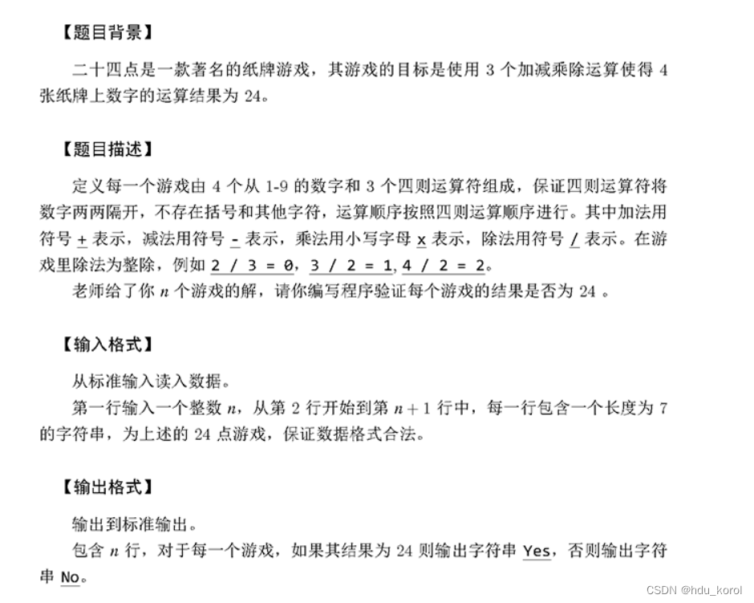

# 解决方案

博主之前定义的变量为`char a,b;`，实际应该是`int a,b;` 计算的时候变成了ASCII码进行运算，导致部分结果出错，但我codeblock编译器没有任何报错。 此外，我对运算符优先级判断部分进行了小小优化。 2022/6/22更新：

## 修改代码

```cpp
#include<bits/stdc++.h>
using namespace std;

int isprior(char a, char b) {
    if (a == 'x'  a == '/')
        return 1;
    else if (b=='+'b=='-')
        return 1;
    else
        return 0;
}

int main()
{
    stack<char> s;//符号
    stack<int> p;//数值
    int n,ans;
    string str;
    char top;
    int a,b;//之前错误代码为 char a,b;

    cin>>n;
    for(int i=0;i<n;i++)
    {
        cin>>str;
        for(char c:str)
        {
            if(c>='0'&&c<='9')
                p.push(c-48);
            else
            {
                while(!s.empty())
                {
                    top=s.top();
                    //栈顶符号优先级高就出栈进行运算，否则新的运算符入栈
                    if(isprior(top,c))
                    {
                        s.pop();
                        b=p.top();
                        p.pop();
                        a=p.top();
                        p.pop();
                        if(top=='x')
                            p.push(a*b);
                        else if(top=='/')
                            p.push(a/b);
                        else if(top=='+')
                            p.push(a+b);
                        else
                            p.push(a-b);
                    }
                    else
                        break;
                }
                s.push(c);
            }
        }
        //栈中剩余符号继续运算
        while(!s.empty())
        {
            top=s.top();
            s.pop();
            b=p.top();
            p.pop();
            a=p.top();
            p.pop();
            if(top=='x')
                p.push(a*b);
            else if(top=='/')
                p.push(a/b);
            else if(top=='+')
                p.push(a+b);
            else
                p.push(a-b);
        }

        ans=p.top();
        p.pop();
        if(ans==24)
            cout<<"Yes"<<endl;
        else
            cout<<"No"<<endl;
    }
    return 0;
}
```

————————————————————————————— 以下为2022/6/18的原帖内容。

# 原始问题

## 提交结果

我的测试样例全部通过了但是只有70分，求大佬帮我看看哪里出了问题 

## 题目描述



## 样例输入

```
10
9+3+4x3
5+4x5x5
7-9-9+8
5x6/5x4
3+5+7+9
1x1+9-9
1x9-5/9
8/5+6x9
6x7-3x6
6x4+4/5
```

## 样例输出

```
Yes
No
No
Yes
Yes
No
No
No
Yes
Yes
```

## 错误代码

我用了两个栈实现，一个存放数值，一个存放符号。

```c
#include<bits/stdc++.h>
using namespace std;

int main()
{
    stack<char> s;//符号
    stack<int> p;//数值
    int n,ans;
    string str;
    char top,a,b;
    map<char,int> dict;

    int priority[4][4]={
        {1,1,0,0},
        {1,1,0,0},
        {1,1,1,1},
        {1,1,1,1}
    };
    dict['+']=0;
    dict['-']=1;
    dict['x']=2;
    dict['/']=3;
    cin>>n;
    for(int i=0;i<n;i++)
    {
        cin>>str;
        for(char c:str)
        {
            if(c>='0'&&c<='9')
                p.push(c-48);
            else
            {
                while(!s.empty())
                {
                    top=s.top();
                    //栈顶符号优先级高，出栈进行运算，否则新的运算符入栈
                    if(priority[dict[top]][dict[c]])
                    {
                        s.pop();
                        b=p.top();
                        p.pop();
                        a=p.top();
                        p.pop();
                        if(top=='x')
                            p.push(a*b);
                        else if(top=='/')
                            p.push(a/b);
                        else if(top=='+')
                            p.push(a+b);
                        else
                            p.push(a-b);
                    }
                    else
                        break;
                }
                s.push(c);
            }
        }
        //栈中剩余符号继续运算
        while(!s.empty())
        {
            top=s.top();
            s.pop();
            b=p.top();
            p.pop();
            a=p.top();
            p.pop();
            if(top=='x')
                p.push(a*b);
            else if(top=='/')
                p.push(a/b);
            else if(top=='+')
                p.push(a+b);
            else
                p.push(a-b);
        }

        ans=p.top();
        p.pop();
        if(ans==24)
            cout<<"Yes"<<endl;
        else
            cout<<"No"<<endl;
    }
    return 0;
}
```
