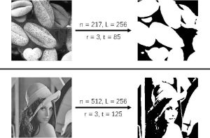

## 题目

【试题背景】 顿顿在学习了数字图像处理后，想要对手上的一副灰度图像进行降噪处理。不过该图像仅在较暗区域有很多噪点，如果贸然对全图进行降噪，会在抹去噪点的同时也模糊了原有图像。因此顿顿打算先使用**邻域均值**来判断一个像素是否处于**较暗区域**，然后仅对处于**较暗区域**的像素进行降噪处理。

【问题描述】 待处理的灰度图像长宽皆为 n 个像素，可以表示为一个 n×n大小的矩阵 A，其中每个元素是一个\[0,L)范围内的整数，表示对应位置像素的灰度值。 对于矩阵中任意一个元素$A_{ij}$(0≤i,j<n) ，其邻域定义为附近若干元素的集和： $111$

这里使用了一个额外的参数 r 来指明$A_{ij}$附近元素的具体范围。根据定义，易知$neighbor(i,j,r)$最多有$(2r+1)^2$个元素。

如果元素$A_{ij}$**邻域**中所有元素的**平均值**小于或等于一个给定的阈值 t，我们就认为该元素对应位置的像素处于较暗区域。 下图给出了两个例子，左侧图像的较暗区域在右侧图像中展示为黑色，其余区域展示为白色。 

现给定邻域参数 r 和阈值 t，试统计输入灰度图像中有多少像素处于**较暗区域**。

【输入格式】 输入共 n+1 行。

输入的第一行包含四个用空格分隔的正整数 n、L、r 和 t，含义如前文所述。

第二到第 n+1 行输入矩阵 A。 第`i+2`(0≤i<n)行包含用空格分隔的 n 个整数，依次为$A_{i0},A_{i1},···,A_{i(n-1)}$。

【输出格式】 输出一个整数，表示输入灰度图像中处于较暗区域的像素总数。

【样例输入】

```
4 16 1 6
0 1 2 3
4 5 6 7
8 9 10 11
12 13 14 15
```

【样例输出】

```
7
```

【样例输入】

```
11 8 2 2
0 0 0 0 0 0 0 0 0 0 0
0 0 0 0 0 0 0 0 0 0 0
0 7 0 0 0 7 0 0 7 7 0
7 0 7 0 7 0 7 0 7 0 7
7 0 0 0 7 0 0 0 7 0 7
7 0 0 0 0 7 0 0 7 7 0
7 0 0 0 0 0 7 0 7 0 0
7 0 7 0 7 0 7 0 7 0 0
0 7 0 0 0 7 0 0 7 0 0
0 0 0 0 0 0 0 0 0 0 0
0 0 0 0 0 0 0 0 0 0 0
```

【样例输出】

```
83
```

## 代码

```cpp
//二维数组前缀和
#include <bits/stdc++.h>

using namespace std;

const int N = 600 + 1;
int a[N][N], psum[N][N];

int main()
{
    std::ios::sync_with_stdio(false);
    cin.tie(NULL);
    cout.tie(NULL);
    memset(psum, 0, sizeof psum);

    int n,L,r,t,Lsum,cnt=0;
    int row1,row2,col1,col2;
    cin>>n>>L>>r>>t;
    for(int i=1;i<=n;i++)
    {
        for(int j=1;j<=n;j++)
        {
            cin>>a[i][j];
            psum[i][j]=psum[i][j-1]+psum[i-1][j]-psum[i-1][j-1]+a[i][j];
        }
    }
    for(int i=1;i<=n;i++)
    {
        row1=max(0,i-r-1);
        row2=min(n,i+r);
        for(int j=1;j<=n;j++)
        {
            col1=max(0,j-r-1);
            col2=min(n,j+r);
            Lsum=psum[row2][col2]-psum[row1][col2]-psum[row2][col1]+psum[row1][col1];
            //cout<<i<<j<<' '<<Lsum<<' '<<(col2-col1)*(row2-row1)*t<<endl;
            if(Lsum<=(col2-col1)*(row2-row1)*t)
            {

                cnt++;
            }
        }
    }
    cout<<cnt<<endl;
}
```
