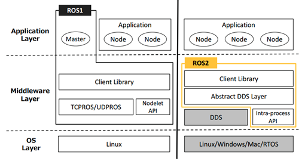
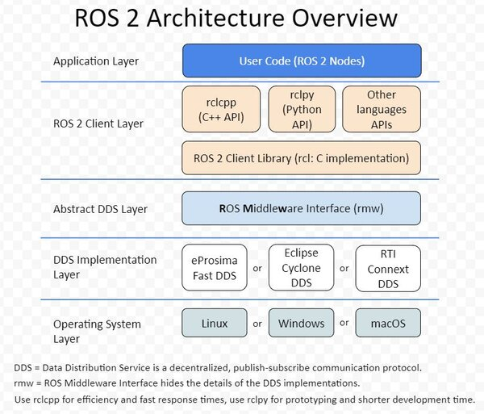
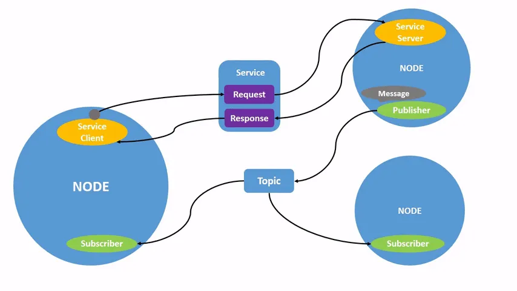

# ROS2入门篇

## 架构图





## 概念简介

### 客户端库 RCL

RCL（ROS Client Library）ROS客户端库，其实就是ROS的一种API，提供了对ROS话题、服务、参数、Action等接口。

### 中间件

ROS1的中间件是ROS组织自己基于TCP/UDP机制建立的。

ROS2采用了第三方的DDS作为中间件，将DDS服务接口进行了一层抽象，保证了上层应用层调用接口的统一性。

ROS2为每家DDS供应商都开发了对应的DDS\_Interface即DDS接口层，然后通过DDS Abstract抽象层RMW(**R**OS **M**iddle**w**are Interface)来统一DDS的API。

## 第一个节点的编写及编译

### 编写

first\_node.cpp

```c++
#include "rclcpp/rclcpp.hpp"

int main(int argc, char **argv)
{
    // 调用rclcpp的初始化函数
    rclcpp::init(argc, argv);
    // 调用rclcpp的循环运行我们创建的first_node节点
    rclcpp::spin(std::make_shared<rclcpp::Node>("first_node"));
    return 0;
}
```

CmakLists.txt

```cmake
cmake_minimum_required(VERSION 3.22)
project(first_node)

find_package(rclcpp REQUIRED)
add_executable(first_node first_ros2_node.cpp)
target_link_libraries(first_node rclcpp::rclcpp)
```

### Cmake

创建一个新的目录build，运行cmake并进行编译

```shell
mkdir build
cd build
```

运行cmake指令，`..`代表到上级目录找`CMakeLists.txt`

```
cmake ..
```

运行完cmake你应该可以在build目录下看到cmake自动生成的Makefile了，接着就可以运行make指令进行编译

```
make
```

运行完上面的指令，就可以在build目录下发现`first_node`节点了

### Colcon

只编译一个包

```
colcon build --packages-select YOUR_PKG_NAME 
```

不编译测试单元

```
colcon build --packages-select YOUR_PKG_NAME  --cmake-args -DBUILD_TESTING=0
```

运行编译的包的测试

```
colcon test
```

允许通过更改src下的部分文件来改变install（重要）

每次调整 python 脚本时都不必重新build了

```
colcon build --symlink-install
```

你可能需要一个梯子翻个墙：[点击这里试试小鱼用了很多年的梯子](https://portal.shadowsocks.nz/aff.php?aff=41638)

## 节点介绍

### 交互

节点与节点之间就必须要通信了，那他们之间该如何通信呢？ROS2早已为你准备好了一共四种通信方式:

*   话题-topics
    
*   服务-services
    
*   动作-Action
    
*   参数-parameters
    
    

### 节点相关的CLI

运行节点(常用)

```
ros2 run <package_name> <executable_name>
```

查看节点列表(常用)：

```
ros2 node list
```

查看节点信息(常用)：

```
ros2 node info <node_name>
```

重映射节点名称

```
ros2 run turtlesim turtlesim_node --ros-args --remap __node:=my_turtle
```

运行节点时设置参数

```
ros2 run example_parameters_rclcpp parameters_basic --ros-args -p rcl_log_level:=10
```
