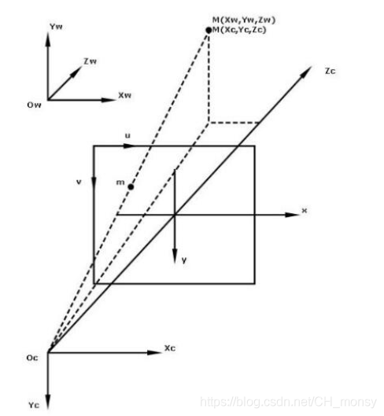
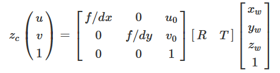
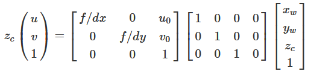
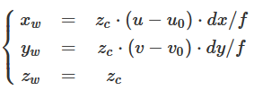
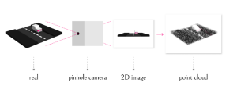

## 原理

首先，要了解下世界坐标到图像的映射过程，考虑世界坐标点M(Xw,Yw,Zw)映射到图像点m(u,v)的过程，如下图所示：



**形式化表示如下**：



u,v分别为图像坐标系下的任意坐标点。u0,v0分别为图像的中心坐标。xw,yw,zw表示世界坐标系下的三维坐标点。zc表示相机坐标的z轴值，即目标到相机的距离。R,T分别为外参矩阵的3x3旋转矩阵和3x1平移矩阵。

**对外参矩阵的设置：由于世界坐标原点和相机原点是重合的，即没有旋转和平移，所以**


相机坐标系和世界坐标系的坐标原点重合，因此相机坐标和世界坐标下的同一个物体具有相同的深度，即zc=zw.于是公式可进一步简化为：



从以上的变换矩阵公式，可以计算得到图像点\[u,v\]T 到世界坐标点\[xw,yw,zw\]T的变换公式:



这里Zc是深度值，相机内参为：fx=f/dx, fy= f/dy, cx=u0, cy = v0;



## 代码实现

```c++
void OBCameraNode::Get_World_Pix_By_Depth(float k[],float scale,int color_x, int color_y, short dep_z, float& world_x, float& world_y, float& world_z) {

    float u=(float)color_x;
    float v=(float)color_y;
    float depthv =dep_z*scale;
    // k[0]:fx k[1]:cx 
    // k[2]:fy k[3]:cy
    world_z = depthv;
    world_x = (u - k[1]) * depthv / k[0];
    world_y = (v - k[3]) * depthv / k[2];
}
```
